# rn-components-kit

English | [中文](./README.zh-CN.md)

A series of commonly used react-native components.

## Screenshots

  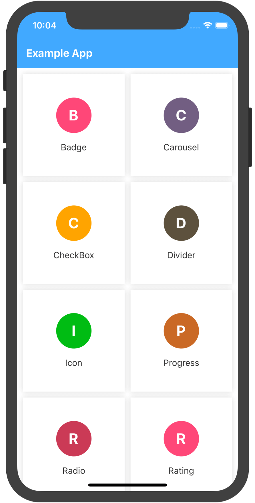
  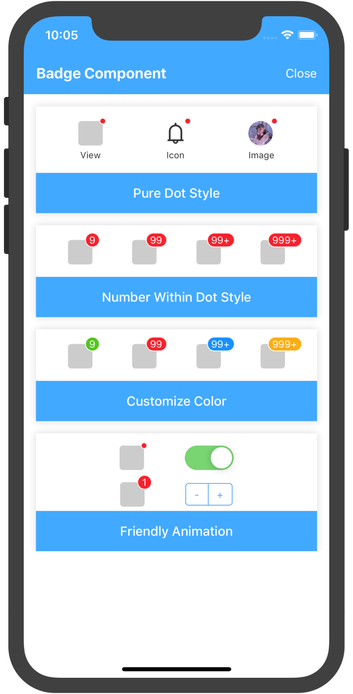
  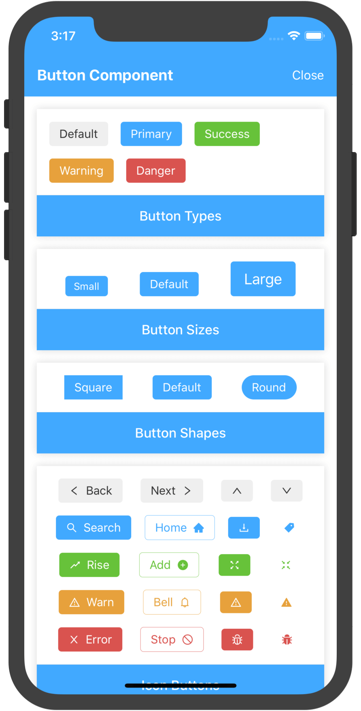
  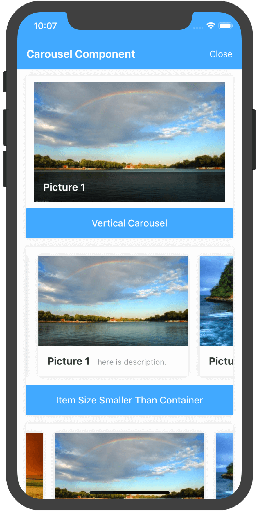
  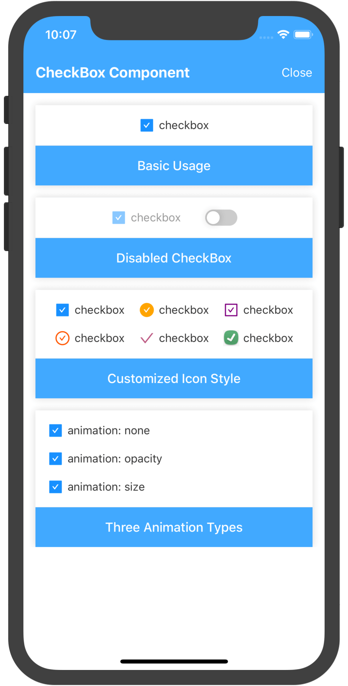
  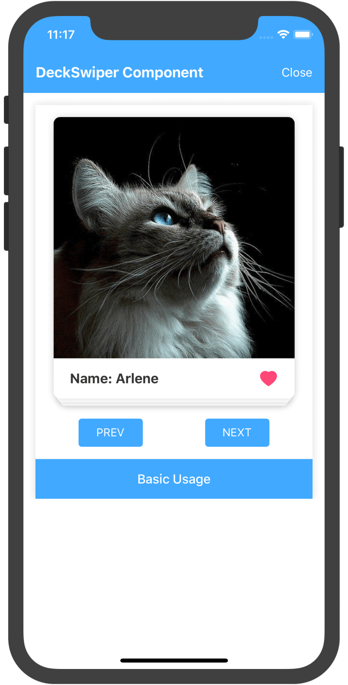
  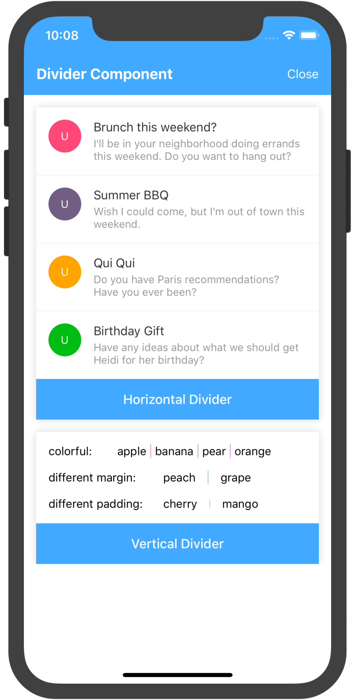
  
  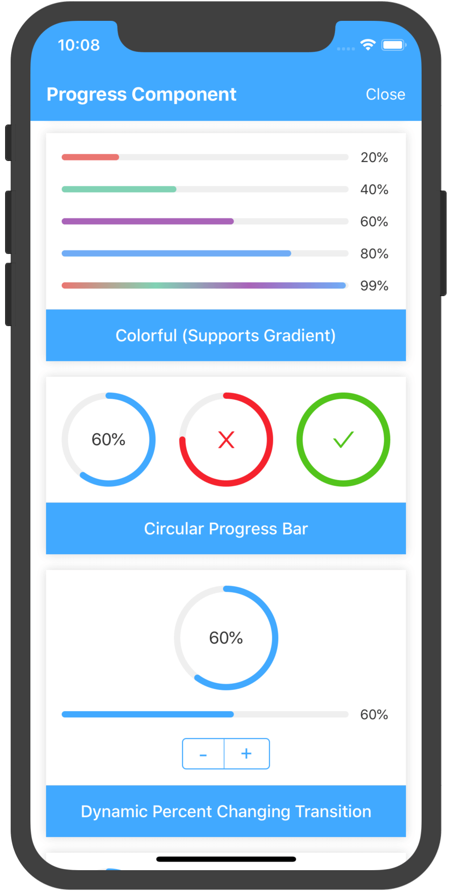
  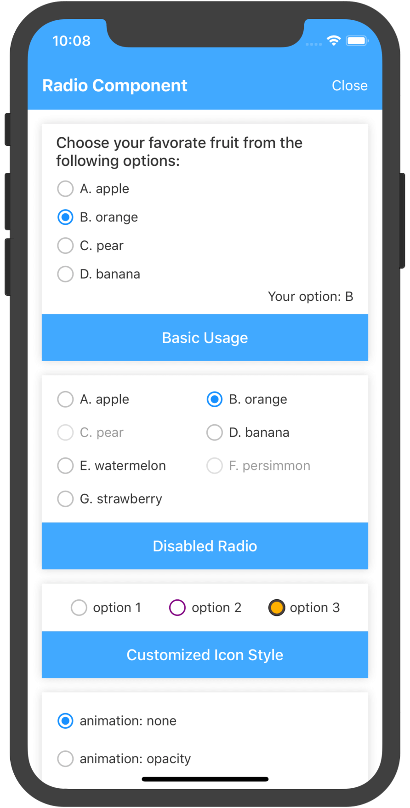
  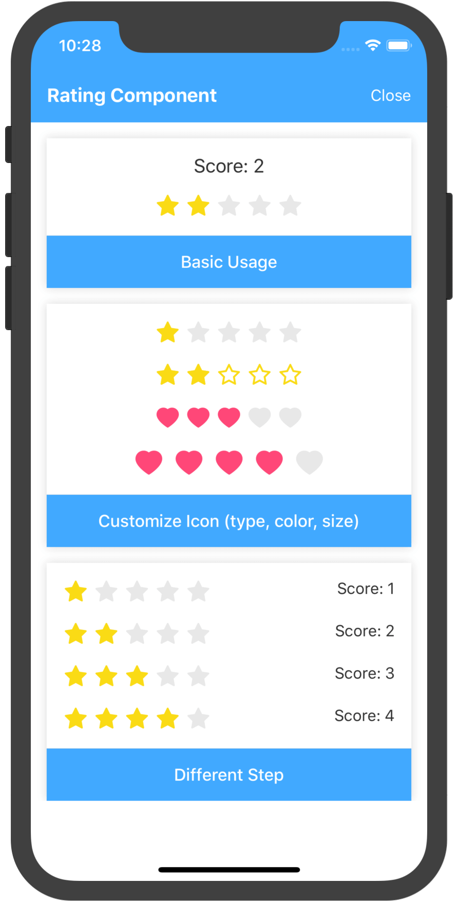
  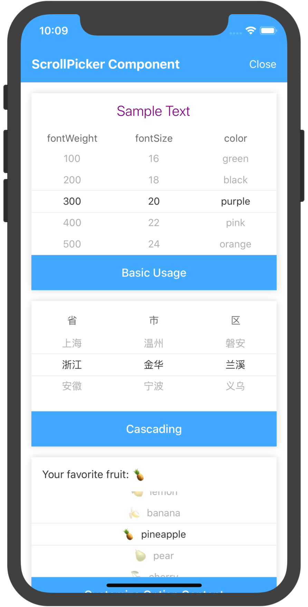
  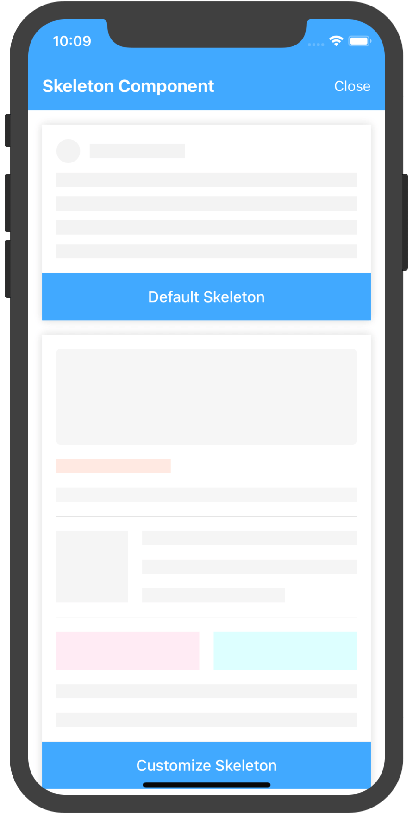
  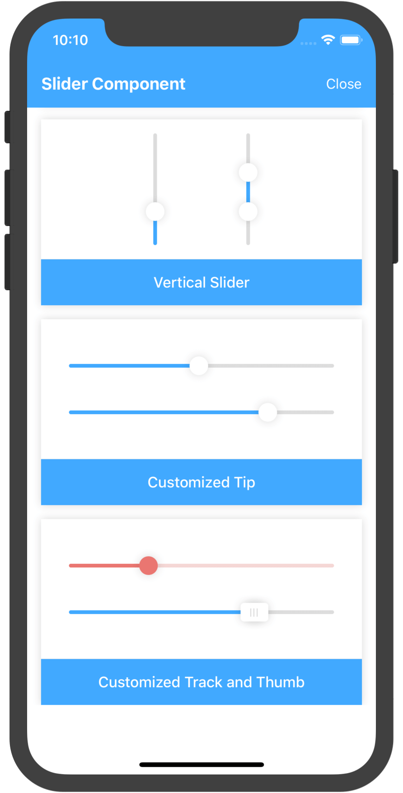
  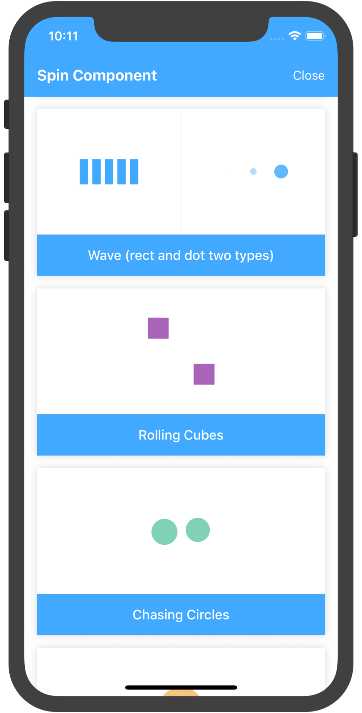
  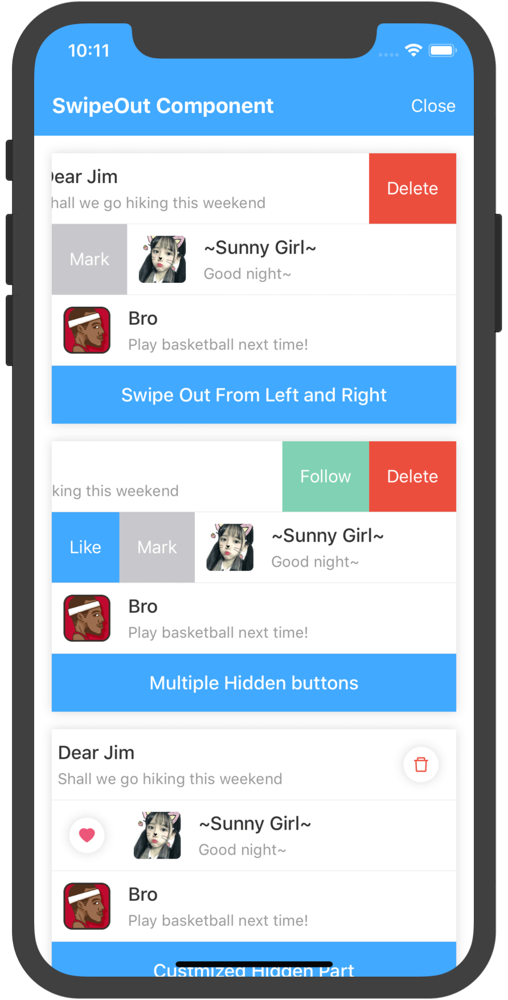
  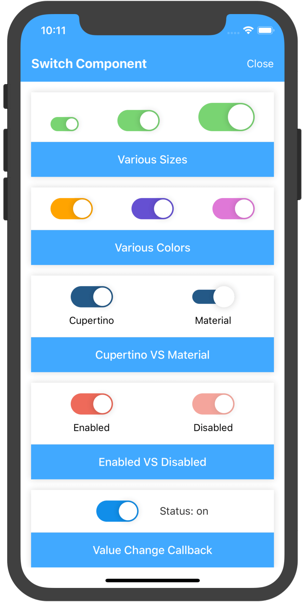
  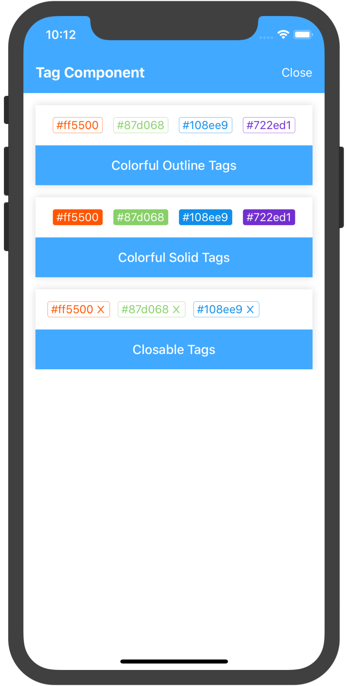
  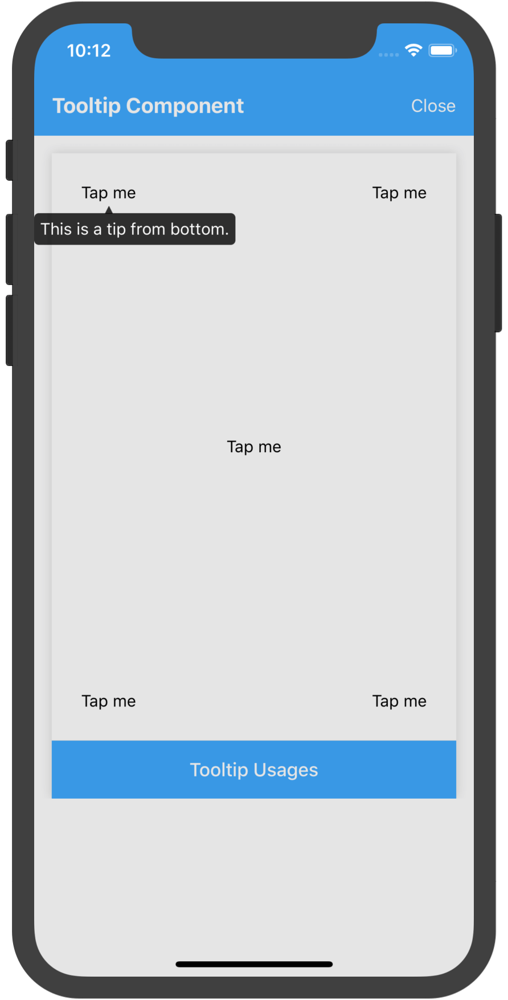

## Components

|component|version|
|---------|-------|
|[badge](https://github.com/SmallStoneSK/rn-components-kit/tree/master/packages/Badge)||
|[button](https://github.com/SmallStoneSK/rn-components-kit/tree/master/packages/Button)||
|[carousel](https://github.com/SmallStoneSK/rn-components-kit/tree/master/packages/Carousel)||
|[checkbox](https://github.com/SmallStoneSK/rn-components-kit/tree/master/packages/CheckBox)||
|[deck-swiper](https://github.com/SmallStoneSK/rn-components-kit/tree/master/packages/DeckSwiper)||
|[divider](https://github.com/SmallStoneSK/rn-components-kit/tree/master/packages/Divider)||
|[icon](https://github.com/SmallStoneSK/rn-components-kit/tree/master/packages/Icon)||
|[progress](https://github.com/SmallStoneSK/rn-components-kit/tree/master/packages/Progress)||
|[radio](https://github.com/SmallStoneSK/rn-components-kit/tree/master/packages/Radio)||
|[rating](https://github.com/SmallStoneSK/rn-components-kit/tree/master/packages/Rating)||
|[scroll-picker](https://github.com/SmallStoneSK/rn-components-kit/tree/master/packages/ScrollPicker)||
|[skeleton](https://github.com/SmallStoneSK/rn-components-kit/tree/master/packages/Skeleton)||
|[slider](https://github.com/SmallStoneSK/rn-components-kit/tree/master/packages/Slider)||
|[spin](https://github.com/SmallStoneSK/rn-components-kit/tree/master/packages/Spin)||
|[swipe-out](https://github.com/SmallStoneSK/rn-components-kit/tree/master/packages/SwipeOut)||
|[switch](https://github.com/SmallStoneSK/rn-components-kit/tree/master/packages/Switch)||
|[tag](https://github.com/SmallStoneSK/rn-components-kit/tree/master/packages/Tag)||
|[text](https://github.com/SmallStoneSK/rn-components-kit/tree/master/packages/Text)||
|[tooltip](https://github.com/SmallStoneSK/rn-components-kit/tree/master/packages/Tooltip)||
