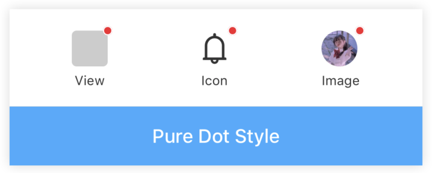
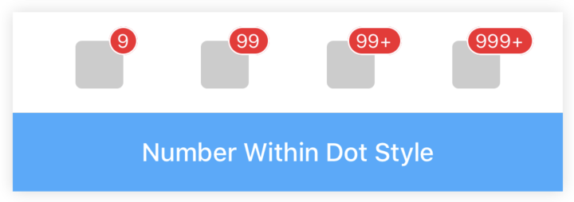
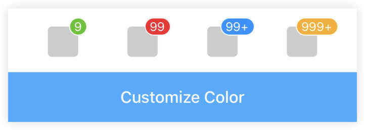
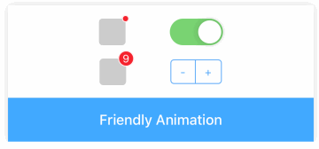

# Badge

[](https://www.npmjs.com/package/@rn-components-kit/badge)

[English](./README.md) | 中文

图标右上角的圆形徽标数字。支持以下特性：

- 纯圆点和带文字圆点两种样式
- 自定义颜色
- 友好的过渡动画

:warning: **注意**

Badge组件支持`<Badge>{your component}</Badge>`和`<Badge/>`两种用法。当你将自定义的组件作为children传入时（即采用第一种用法），红点将会自动出现在你传入的组件的右上角。

然而，`overflow: visible is not supported on Android`这个问题直到react-native@0.57 ([change log](https://github.com/react-native-community/releases/blob/master/CHANGELOG.md#android-specific-additions-3) and [commit b81c8b5](https://github.com/facebook/react-native/commit/b81c8b5))上才解决。所以，如果你的项目在用的react-native版本小于0.57的话，Badge组件在Android上显示时可能会被截断。这种情况下，你可以采用第二种方法先渲染出Badge组件，然后自行布局定位将其放置合适的位置。

## 使用

```bash
npm install @rn-components-kit/badge --save
```

|预览|代码|
|------------|:---------:|
||[Demo1 Code](./demos/Demo1.js)|
||[Demo2 Code](./demos/Demo2.js)|
||[Demo3 Code](./demos/Demo3.js)|
||[Demo4 Code](./demos/Demo4.js)|

## Props

- [`style`](#style)
- [`dot`](#dot)
- [`color`](#color)
- [`count`](#count)
- [`overflowCount`](#overflowCount)
- [`showZero`](#showZero)
- [`offsetX`](#offsetX)
- [`offsetY`](#offsetY)


## 文档

### Props

#### `style`

自定义样式

|类型|必填|默认值|
|----|--------|-------|
|object|否|-|

#### `dot`

是否以不展示数字在中间的样式展示

|类型|必填|默认值|
|----|--------|-------|
|string|否|true|

#### `color`

徽章颜色

|类型|必填|默认值|
|----|--------|-------|
|string|否|'#F5222D'|

#### `count`

如果指定了`count`属性，那么请将`dot`属性置为false（这两种模式是互斥的，dot的优先级更高）。这种情况下，圆点中间将会展示对应的数字。

|类型|必填|默认值|
|----|--------|-------|
|number|否|0|

#### `overflowCount`

最大能展示的数字。如果`count`的值大于`overflowCount`，那么将会以`${overflowCount}+`的形式展示{overflowCount}+`

|类型|必填|默认值|
|----|--------|-------|
|number|否|99|

#### `showZero`

决定当count为0时是否展示

|类型|必填|默认值|
|----|--------|-------|
|string|否|false|

#### `offsetX`

当你不满意右上角的圆点位置时，可以通过设置`offsetX/offsetY`的值来微调位置

|类型|必填|默认值|
|----|--------|-------|
|number|否|0|

#### `offsetY`

当你不满意右上角的圆点位置时，可以通过设置`offsetX/offsetY`的值来微调位置

|类型|必填|默认值|
|----|--------|-------|
|number|否|0|
