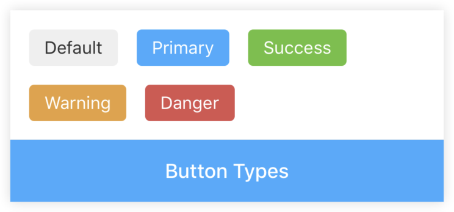
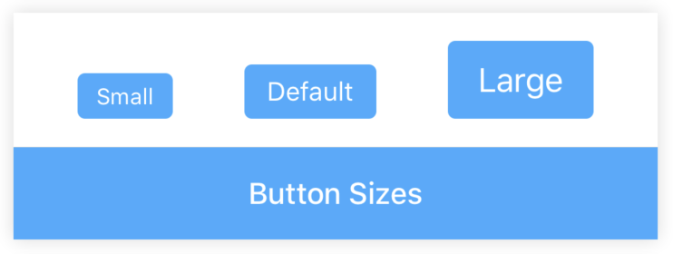
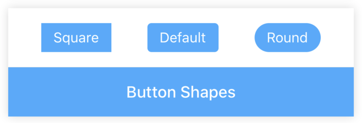
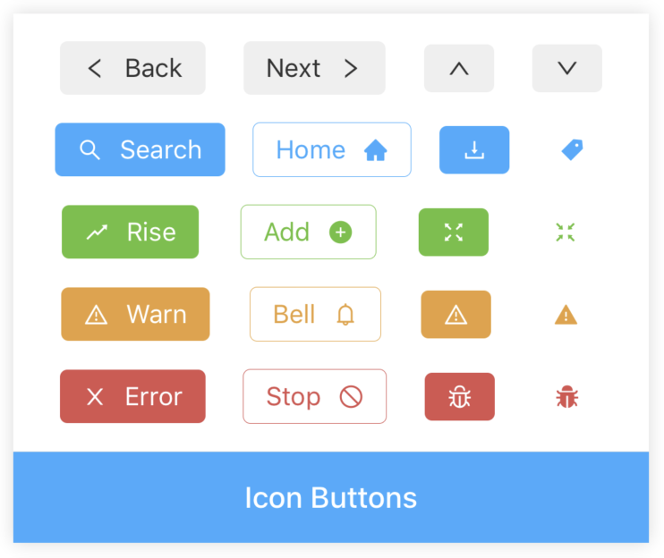
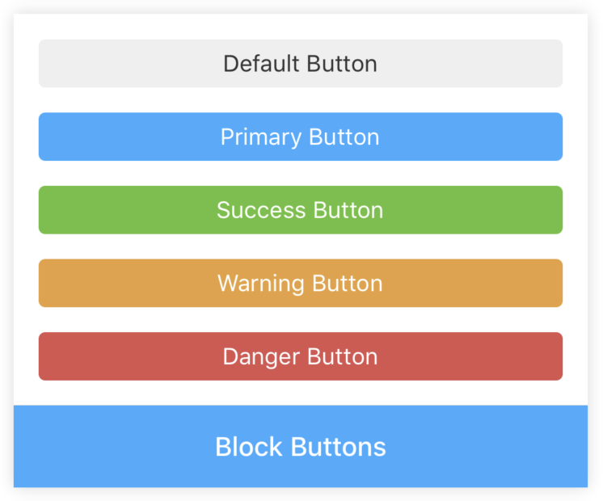
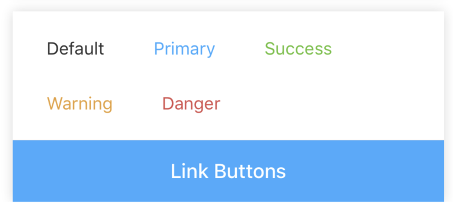
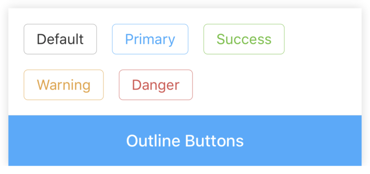

# Button

[](https://www.npmjs.com/package/@rn-components-kit/button)

English | [中文](./README.zh-CN.md)

按钮组件，支持以下特性：

- `default`，`primary`，`success`，`warning`和`danger`5种主题
- `small`，`default`和`large`3种大小
- `square`，`default`和`round`3种形状
- 支持`icon`按钮和控制图标位置
- 支持`outline`样式按钮
- 支持`block`样式按钮
- 支持`link`样式按钮

## 使用

```bash
npm install @rn-components-kit/button --save
```

|预览|代码|
|------------|:---------:|
||[Demo1 Code](./demos/Demo1.js)|
||[Demo2 Code](./demos/Demo2.js)|
||[Demo3 Code](./demos/Demo3.js)|
||[Demo4 Code](./demos/Demo4.js)|
||[Demo5 Code](./demos/Demo5.js)|
||[Demo6 Code](./demos/Demo6.js)|
||[Demo7 Code](./demos/Demo7.js)|

## Props

- [`style`](#style)
- [`text`](#text)
- [`icon`](#icon)
- [`iconLeft`](#iconLeft)
- [`type`](#type)
- [`size`](#size)
- [`shape`](#shape)
- [`block`](#block)
- [`outline`](#outline)
- [`link`](#link)

## Methods

- [`updatePreset`](#updatePreset)

## 文档

### Props

#### `style`

自定义样式

|类型|必填|默认值|
|----|--------|-------|
|object|否|-|

#### `text`

按钮中的文本

|类型|必填|默认值|
|----|--------|-------|
|string|否|-|

#### `icon`

按钮中的图标

|类型|必填|默认值|
|----|--------|-------|
|[Icon Preset](https://github.com/SmallStoneSK/rn-components-kit/tree/master/packages/Icon#icon-types)|否|-|

#### `iconLeft`

控制图标显示在按钮的左边还是右边

|类型|必填|默认值|
|----|--------|-------|
|boolean|否|true|

#### `type`

按钮类型，决定按钮的主题颜色

|类型|必填|默认值|
|----|--------|-------|
|枚举值(`'default'` \| `'primary'` \| `'success'` \| `'warning'` \| `'danger'` \| `'link'`)|否|'default'|

#### `size`

按钮大小

|类型|必填|默认值|
|----|--------|-------|
|enum(`'small'` \| `'default'` \| `'large'`)|否|'default'|

#### `shape`

按钮形状

|类型|必填|默认值|
|----|--------|-------|
|enum(`'default'` \| `'round'` \| `'square'`)|否|'default'|

#### `block`

Block级别按钮（横向拉伸，与父元素等宽）

|类型|必填|默认值|
|----|--------|-------|
|boolean|否|false|

#### `outline`

外轮廓样式按钮

|类型|必填|默认值|
|----|--------|-------|
|boolean|否|false|

#### `link`

链接样式按钮

|类型|必填|默认值|
|----|--------|-------|
|boolean|否|false|

### Methods

#### `updatePreset`

```js
updatePreset(preset);
```

该方法提供机会可以修改Button组件内置的样式配置。内置配置如下：

```json
{
  "theme": {
    "default": "#EFEFEF",
    "primary": "#40A9FF",
    "warning": "#E6A23C",
    "danger": "#D9534F",
    "success": "#67C23A"
  },
  "small": {
    "fontSize": 12,
    "borderRadius": 4,
    "paddingHorizontal": 10,
    "paddingVertical": 5,
    "iconTextSpacing": 5
  },
  "default": {
    "fontSize": 14,
    "borderRadius": 4,
    "paddingHorizontal": 12,
    "paddingVertical": 6,
    "iconTextSpacing": 7
  },
  "large": {
    "fontSize": 18,
    "borderRadius": 4,
    "paddingHorizontal": 16,
    "paddingVertical": 10,
    "iconTextSpacing": 9
  }
}
```
