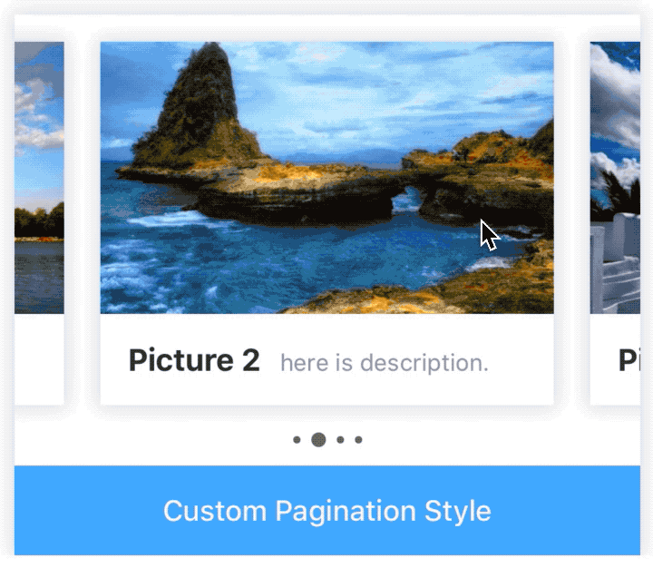

# Carousel

[](https://www.npmjs.com/package/@rn-components-kit/carousel)

English | [中文](./README.zh-CN.md)

A slideshow component for cycling through elements (image or text), just like a carousel. It supports the following features:

- horizontal/vertical two directions
- loop mode
- auto play mode
- center mode, item would be adjusted to the screen's center
- supports children that have lengths smaller than the container

:warning: **NOTE**

1. When carousel is in `horizontal` mode, `width` and `itemWidth` must be set.
2. When carousel is in `vertical` mode, `height` and `itemHeight` must be set.
3. If the data source of carousel's children would change, you should set the `data` prop. Or the children of carousel would not be updated.
4. Following picture will help you understand some important required variables:


## How to use

```bash
npm install @rn-components-kit/carousel --save
```

|Preview|Code|
|------------|:---------:|
||[Demo1 Code](./demos/Demo1.js)|
||[Demo2 Code](./demos/Demo2.js)|
||[Demo3 Code](./demos/Demo3.js)|
||[Demo4 Code](./demos/Demo4.js)|
||[Demo5 Code](./demos/Demo5.js)|
||[Demo6 Code](./demos/Demo6.js)|
||[Demo7 Code](./demos/Demo7.js)|

## Props

- [`style`](#style)
- [`initialIndex`](#initialIndex)
- [`draggable`](#draggable)
- [`vertical`](#vertical)
- [`width`](#width)
- [`height`](#height)
- [`itemWidth`](#itemWidth)
- [`itemHeight`](#itemHeight)
- [`gap`](#gap)
- [`loop`](#loop)
- [`cloneCount`](#cloneCount)
- [`centerModeEnabled`](#centerModeEnabled)
- [`autoPlay`](#autoPlay)
- [`autoPlayDelay`](#autoPlayDelay)
- [`showPagination`](#showPagination)
- [`paginationStyle`](#paginationStyle)
- [`dotStyle`](#dotStyle)
- [`curDotStyle`](#curDotStyle)
- [`renderPagination`](#renderPagination)
- [`onIndexChange`](#onIndexChange)
- [`scrollToPrev`](#scrollToPrev)
- [`scrollToNext`](#scrollToNext)
- [`scrollToIndex`](#scrollToIndex)

## Reference

### Props

#### `style`

Allows you to custom style

|Type|Required|Default|
|----|--------|-------|
|object|no|-|

#### `initialIndex`

Determines the position when carousel first show

|Type|Required|Default|
|----|--------|-------|
|number|no|0|

#### `draggable`

 Determines whether carousel can be dragged to slide to prev/next one

|Type|Required|Default|
|----|--------|-------|
|boolean|no|true|

#### `vertical`

Determines whether caousel is in horizontal or vertical direction

|Type|Required|Default|
|----|--------|-------|
|boolean|no|false|

#### `width`

The width of carousel (when carousel is in `horizontal` mode, it must be set)

|Type|Required|Default|
|----|--------|-------|
|number|no|-|

#### `height`

The height of carousel (when carousel is in `vertical` mode, it must be set)

|Type|Required|Default|
|----|--------|-------|
|number|no|-|

#### `itemWidth`

The width of each item in carousel (when carousel is in `horizontal` mode, it must be set)

|Type|Required|Default|
|----|--------|-------|
|number|no|-|

#### `itemHeight`

The height of each item in carousel (when carousel is in `vertical` mode, it must be set)

|Type|Required|Default|
|----|--------|-------|
|number|no|-|

#### `gap`

When item's length is smaller than container, gap can be used to separate items

|Type|Required|Default|
|----|--------|-------|
|number|no|0|

#### `loop`

Determines whether carousel's loop mode is enabled

|Type|Required|Default|
|----|--------|-------|
|boolean|no|false|

#### `cloneCount`

When loop mode is enabled, there will be `cloneCount` copied elements placed at both sides of items

|Type|Required|Default|
|----|--------|-------|
|number|no|3|

#### `centerModeEnabled`

When item's length is smaller than container, item would be adjusted to the center of carousel if centerModeEnabled is true. In this case, prev/current/next elements will be all in one screen

|Type|Required|Default|
|----|--------|-------|
|boolean|no|false|

#### `autoPlay`

Determines whether auto play mode is enabled

|Type|Required|Default|
|----|--------|-------|
|boolean|no|false|

#### `autoPlayDelay`

When auto play mode is enabled, it determines how long it takes between two scrolling animations (ms)

|Type|Required|Default|
|----|--------|-------|
|number|no|3000|

#### `showPagination`

Determines whether pagination module is shown in carousel

|Type|Required|Default|
|----|--------|-------|
|boolean|no|false|

#### `paginationStyle`

Allow you to custom pagination's container style

|Type|Required|Default|
|----|--------|-------|
|object|no|-|

#### `dotStyle`

Allow you to custom pagination's dot style

|Type|Required|Default|
|----|--------|-------|
|object|no|-|

#### `curDotStyle`

Allow you to custom pagination's current dot style

|Type|Required|Default|
|----|--------|-------|
|object|no|-|

#### `renderPagination`

```js
(info: {curIndex: number, total: number}) => React.ReactElement | null
```

Allow you to custom pagination module

|Type|Required|Default|
|----|--------|-------|
|function|no|-|

#### `onIndexChange`

```js
(from: number, to: number) => void
```

A callback will be triggered when carousel's scrollIndex changes

|Type|Required|Default|
|----|--------|-------|
|function|no|() => {}|

### Methods

#### `scrollToPrev()`

```js
scrollToPrev();
```

Scrolls to prev item

#### `scrollToNext()`

```js
scrollToNext();
```

Scrolls to next item

#### `scrollToIndex()`

```js
scrollToIndex([options]: {index: number, animated: boolean});
```

Scrolls to the item at the specified index