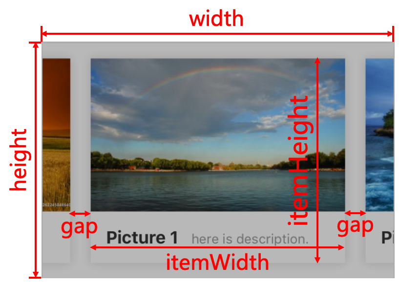
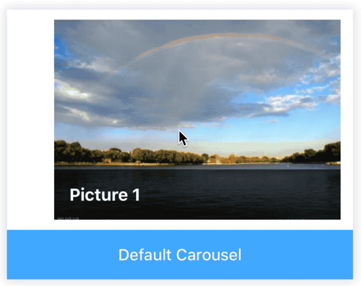
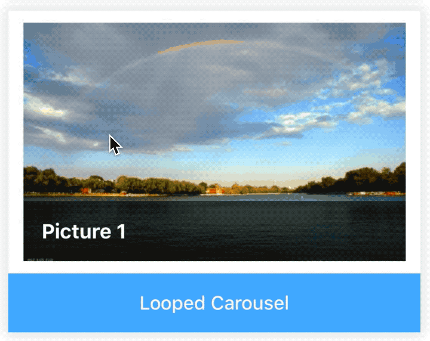
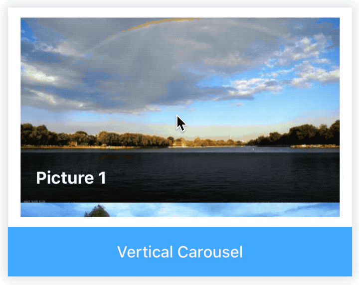
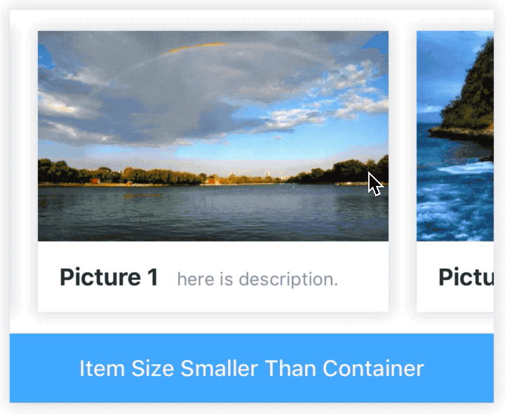
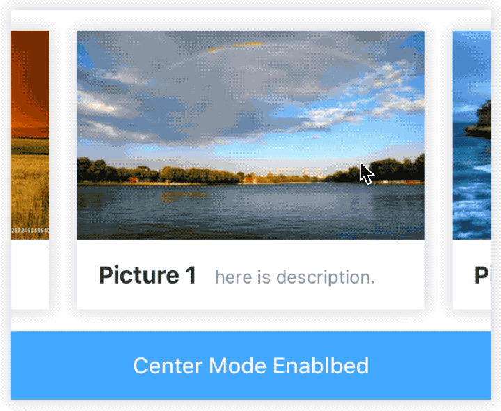
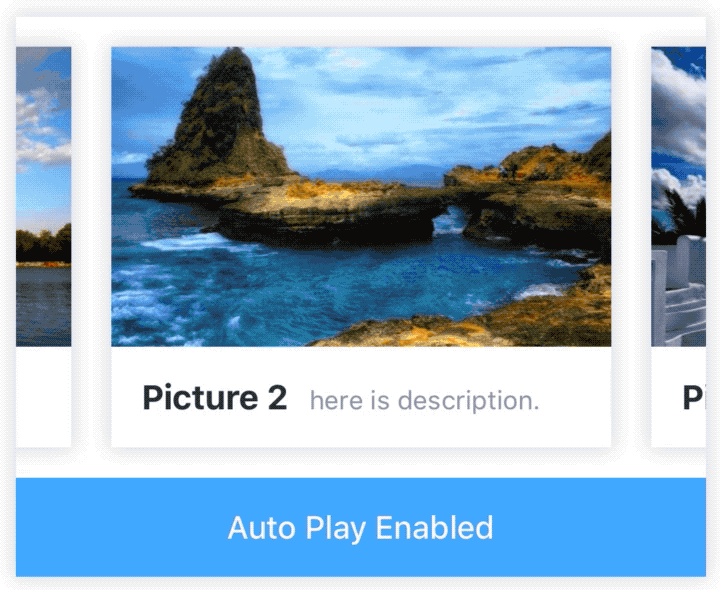

# Carousel

[](https://www.npmjs.com/package/@rn-components-kit/carousel)

[English](./README.md) | 中文

轮播组件，就像"旋转木马"一样。支持以下特性：

- 水平/垂直两个方向
- 循环模式
- 自动播放模式
- 居中模式，当前项会被调整至一屏的中间，同时前一项/后一项也会露出一部分
- 支持轮播内容不足一屏的长度

:warning: **NOTE**

1. 当使用`水平`模式时，`width`和`itemWidth`必须设置。
2. 当使用`垂直`模式时，`height`和`itemHeight`必须设置。
3. 如果轮播组件内容的数据源（数组）是会变化的，需要设置数据源作为`data`属性，不然轮播组件中的内容将不会更新。
4. 下面的图片将有助于理解一些样式上的重要变量含义：



## 使用

```bash
npm install @rn-components-kit/carousel --save
```

|预览|代码|
|------------|:---------:|
||[Demo1 Code](./demos/Demo1.js)|
||[Demo2 Code](./demos/Demo2.js)|
||[Demo3 Code](./demos/Demo3.js)|
||[Demo4 Code](./demos/Demo4.js)|
||[Demo5 Code](./demos/Demo5.js)|
||[Demo6 Code](./demos/Demo6.js)|
||[Demo7 Code](./demos/Demo7.js)|

## Props

- [`style`](#style)
- [`initialIndex`](#initialIndex)
- [`draggable`](#draggable)
- [`vertical`](#vertical)
- [`width`](#width)
- [`height`](#height)
- [`itemWidth`](#itemWidth)
- [`itemHeight`](#itemHeight)
- [`gap`](#gap)
- [`loop`](#loop)
- [`cloneCount`](#cloneCount)
- [`centerModeEnabled`](#centerModeEnabled)
- [`autoPlay`](#autoPlay)
- [`autoPlayDelay`](#autoPlayDelay)
- [`showPagination`](#showPagination)
- [`paginationStyle`](#paginationStyle)
- [`dotStyle`](#dotStyle)
- [`curDotStyle`](#curDotStyle)
- [`renderPagination`](#renderPagination)
- [`onIndexChange`](#onIndexChange)
- [`scrollToPrev`](#scrollToPrev)
- [`scrollToNext`](#scrollToNext)
- [`scrollToIndex`](#scrollToIndex)

## 文档

### Props

#### `style`

自定义样式

|类型|必填|默认值|
|----|--------|-------|
|object|否|-|

#### `initialIndex`

初始时停留的index索引值

|类型|必填|默认值|
|----|--------|-------|
|number|否|0|

#### `draggable`

是否可以通过手指拖动的方式滑至前/后一项

|类型|必填|默认值|
|----|--------|-------|
|boolean|否|true|

#### `vertical`

是否使用垂直方向

|类型|必填|默认值|
|----|--------|-------|
|boolean|否|false|

#### `width`

轮播组件一屏的宽度（当使用`水平`模式时，该值必须设置）

|类型|必填|默认值|
|----|--------|-------|
|number|否|-|

#### `height`

轮播组件一屏的高度（当使用`垂直`模式时，该值必须设置）

|类型|必填|默认值|
|----|--------|-------|
|number|否|-|

#### `itemWidth`

轮播组件一项内容的宽度（当使用`水平`模式时，该值必须设置）

|类型|必填|默认值|
|----|--------|-------|
|number|否|-|

#### `itemHeight`

轮播组件一项内容的高度（当使用`垂直`模式时，该值必须设置）

|类型|必填|默认值|
|----|--------|-------|
|number|否|-|

#### `gap`

轮播组件中每一项内容之间的间隔

|类型|必填|默认值|
|----|--------|-------|
|number|否|0|

#### `loop`

是否使用循环功能

|类型|必填|默认值|
|----|--------|-------|
|boolean|否|false|

#### `cloneCount`

当循环模式开启时，将会有`cloneCount`个元素被拷贝，放在原有元素的两边，从而实现循环的效果

|类型|必填|默认值|
|----|--------|-------|
|number|否|3|

#### `centerModeEnabled`

居中模式。当轮播组件的子项长度不足一屏时，如果启用居中模式，那么当前项将会调整至容器的中间。这种情况下，前一项/当前项/下一项将会同时出现在一屏中

|类型|必填|默认值|
|----|--------|-------|
|boolean|否|false|

#### `autoPlay`

是否使用自动播放

|类型|必填|默认值|
|----|--------|-------|
|boolean|否|false|

#### `autoPlayDelay`

当自动播放模式启用时，该值指定两次滚动动画之间的时间间隔（单位是毫秒）

|类型|必填|默认值|
|----|--------|-------|
|number|否|3000|

#### `showPagination`

是否展示页码模块

|类型|必填|默认值|
|----|--------|-------|
|boolean|否|false|

#### `paginationStyle`

自定义页码模块的容器样式

|类型|必填|默认值|
|----|--------|-------|
|object|否|-|

#### `dotStyle`

自定义页码模块的小圆点样式

|类型|必填|默认值|
|----|--------|-------|
|object|否|-|

#### `curDotStyle`

自定义页码模块中当前小圆点样式

|类型|必填|默认值|
|----|--------|-------|
|object|否|-|

#### `renderPagination`

```js
(info: {curIndex: number, total: number}) => React.ReactElement | null
```

完全自定义页码模块

|类型|必填|默认值|
|----|--------|-------|
|function|否|-|

#### `onIndexChange`

```js
(from: number, to: number) => void
```

当轮播组件的当前索引值发生变化时，会触发该回调函数

|类型|必填|默认值|
|----|--------|-------|
|function|否|() => {}|

### Methods

#### `scrollToPrev()`

```js
scrollToPrev();
```

滚动至前一个元素的位置

#### `scrollToNext()`

```js
scrollToNext();
```

滚动至下一个元素的位置

#### `scrollToIndex()`

```js
scrollToIndex([options]: {index: number, animated: boolean});
```

滚动至指定索引值的元素位置