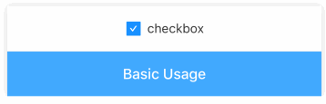
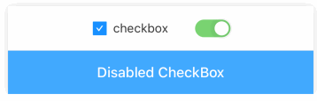
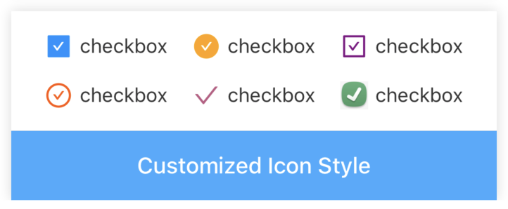
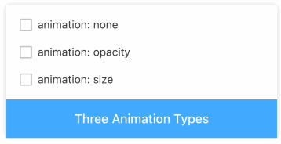

# CheckBox

[](https://www.npmjs.com/package/@rn-components-kit/checkbox)

English | [中文](./README.zh-CN.md)

CheckBoxes allow users to complete tasks that involve making choices such as selecting options, or switching settings on or off.

## How to use

```bash
npm install @rn-components-kit/checkbox --save
```

|Preview|Code|
|------------|:---------:|
||[Demo1 Code](./demos/Demo1.js)|
||[Demo2 Code](./demos/Demo2.js)|
||[Demo3 Code](./demos/Demo3.js)|
||[Demo4 Code](./demos/Demo4.js)|

## Props

- [`style`](#style)
- [`title`](#title)
- [`titleStyle`](#titleStyle)
- [`iconSize`](#iconSize)
- [`disabled`](#disabled)
- [`checked`](#checked)
- [`checkedIconType`](#checkedIconType)
- [`checkedIconColor`](#checkedIconColor)
- [`checkedImage`](#checkedImage)
- [`unCheckedIconType`](#unCheckedIconType)
- [`unCheckedIconColor`](#unCheckedIconColor)
- [`unCheckedImage`](#unCheckedImage)
- [`animationType`](#animationType)
- [`onPress`](#onPress)

## Reference

### Props

#### `style`

Allow you to customize style

|Type|Required|Default|
|----|--------|-------|
|object|no|-|

#### `title`

Title of checkbox

|Type|Required|Default|
|----|--------|-------|
|string|yes|-|

#### `titleStyle`

Allows you to customize title's style

|Type|Required|Default|
|----|--------|-------|
|object|no|-|

#### `iconSize`

Size of icon (or width and height for image, if you specify checkedImage/unCheckedImage)

|Type|Required|Default|
|----|--------|-------|
|number|no|20|

#### `disabled`

Determines whether checkbox is available

|Type|Required|Default|
|----|--------|-------|
|boolean|no|false|

#### `checked`

Flag for checking the icon

|Type|Required|Default|
|----|--------|-------|
|boolean|no|false|

#### `checkedIconType`

Checked icon ([Icon Preset](https://github.com/SmallStoneSK/rn-components-kit/tree/master/packages/Icon))

|Type|Required|Default|
|----|--------|-------|
|string|no|'check-square-fill'|

#### `checkedIconColor`

Color of checked icon

|Type|Required|Default|
|----|--------|-------|
|string|no|'#1890FF'|

#### `checkedImage`

If you are not satisfied with icon preset, you can specify an image for checked icon

|Type|Required|Default|
|----|--------|-------|
|string|no|-|

#### `unCheckedIconType`

UnChecked icon ([Icon Preset](https://github.com/SmallStoneSK/rn-components-kit/tree/master/packages/Icon))

|Type|Required|Default|
|----|--------|-------|
|string|no|'border'|

#### `unCheckedIconColor`

Color of unChecked icon

|Type|Required|Default|
|----|--------|-------|
|string|no|'#BFBFBF'|

#### `unCheckedImage`

If you are not satisfied with icon preset, you can specify an image for unChecked icon

|Type|Required|Default|
|----|--------|-------|
|string|no|-|

#### `animationType`

Determines which animation is adpoted when checked value changes

- none: no animation
- opacity: fade in/out
- size: zoom in/out

|Type|Required|Default|
|----|--------|-------|
|enum(`'none'`, `'opacity'`, `'size'`)|no|'opacity'|

#### `onPress`

```js
() => void
```

A callback will be triggered when checkbox is pressed

|Type|Required|Default|
|----|--------|-------|
|function|no|() => {}|