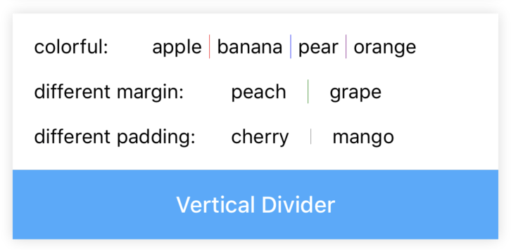

# Divider

[](https://www.npmjs.com/package/@rn-components-kit/divider)

English | [中文](./README.zh-CN.md)

Dividers are visual separators of content. It supports two orientations: `horizontal` and `vertical`.

## How to use

```bash
npm install @rn-components-kit/divider --save
```

|Preview|Code|
|------------|:---------:|
||[Demo1 Code](./demos/Demo1.js)|
||[Demo2 Code](./demos/Demo2.js)|

## Props

- [`style`](#style)
- [`color`](#color)
- [`orientation`](#orientation)
- [`margin`](#margin)
- [`padding`](#padding)

---

## Reference

### Props

#### `style`

Allow you to customize style

|Type|Required|Default|
|----|--------|-------|
|object|no|-|

#### `color`

Determines the divider's color

|Type|Required|Default|
|----|--------|-------|
|string|no|'#DFDFDF'|

#### `orientation`

Determines the divider's orientation

|Type|Required|Default|
|----|--------|-------|
|enum(`'horizontal'`, `'vertical'`)|no|'horizontal'|

#### `margin`

Space between two sides on cross axis

|Type|Required|Default|
|----|--------|-------|
|number|no|0|

#### `padding`

Space inside two sides on main axis

|Type|Required|Default|
|----|--------|-------|
|number|no|0|