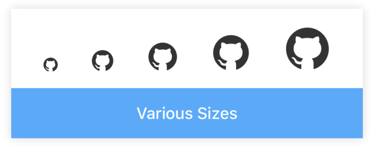
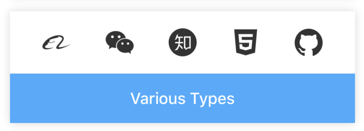
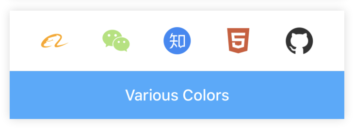
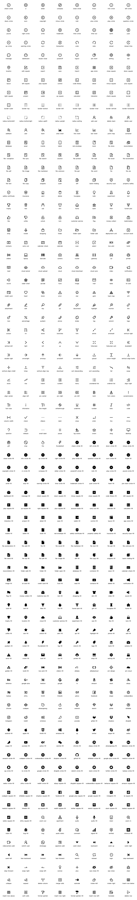

# Icon

[](https://www.npmjs.com/package/@rn-components-kit/icon)

English | [中文](./README.zh-CN.md)

Semantic vector graphics. It supports the following features:

- customize size
- customize color
- integrated in [Ant-Design Preset](https://ant.design/components/icon/)

:warning: **NOTE: Make sure your project has integrated in ART module.**

If you encounter the problem like **No component found for view with name "ARTXXX"**, that's because the `ART` module has not been integrated in your project. You should:

1. Use Xcode to open your ios project, `Libraries` -> `Add Files to` -> `node_modules/react-native/Libraries/ART/ART.xcodeproj`.
2. Click the root of project, find `Linked Frameworks and Libraries`, click `+` to add `libART.a` and rebuild the project.
3. After having rebuilded, re-run command `react-native run-ios/android` to start your project.

## How to use

```bash
npm install @rn-components-kit/icon --save
```

|Preview|Code|
|------------|:---------:|
||[Demo1 Code](./demos/Demo1.js)|
||[Demo2 Code](./demos/Demo2.js)|
||[Demo3 Code](./demos/Demo3.js)|

## Props

- [`style`](#style)
- [`color`](#color)
- [`size`](#size)
- [`type`](#type)

## Reference

### Props

#### `style`

Allow you to customize style

|Type|Required|Default|
|----|--------|-------|
|object|no|-|

#### `color`

Determines the icon's color

|Type|Required|Default|
|----|--------|-------|
|string|no|'#333'|

#### `size`

Determines the icon's size

|Type|Required|Default|
|----|--------|-------|
|number|no|15|

#### `type`

Icon type, integrated in [Ant-Design Preset](https://ant.design/components/icon/)

|Type|Required|Default|
|----|--------|-------|
|[enum types](#icon-types)|yes|-|

## Icon Types


