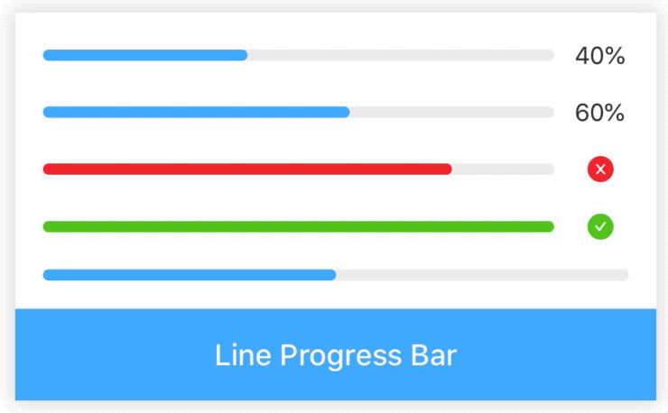
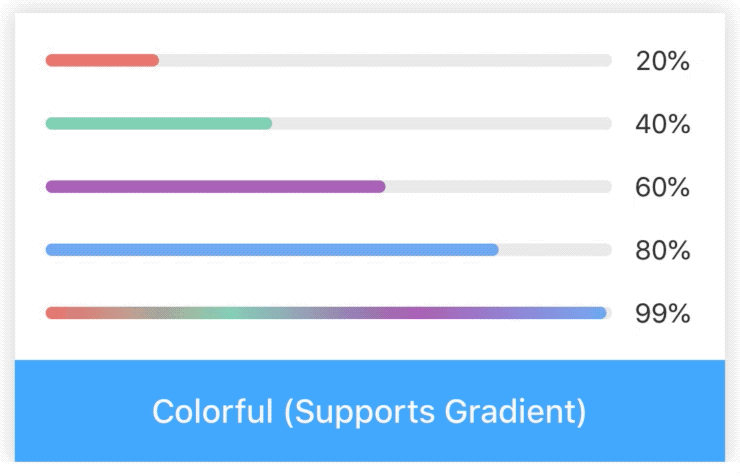
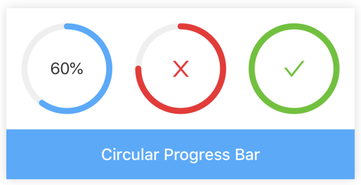
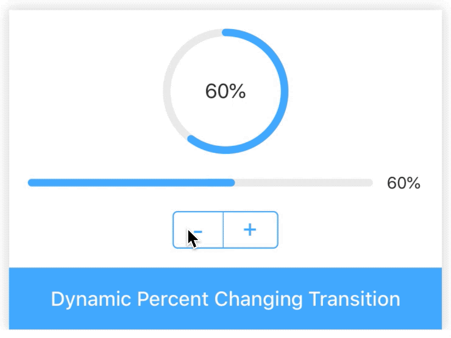
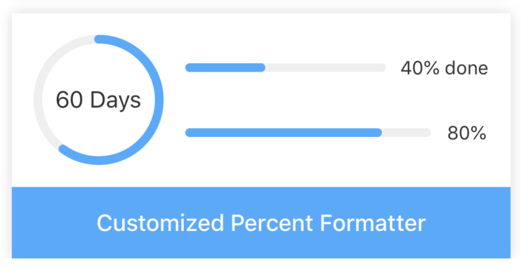

# Progress

[](https://www.npmjs.com/package/@rn-components-kit/progress)

[English](./README.md) | 中文

进度条组件，展示当前操作进度，支持以下特性：

- `line`和`circle`两种类型
- `normal`，`active`，`success`和`fail`四种状态
- 自定义颜色，支持线性渐变（目前仅限`line`类型）
- 自定义进度文案格式，甚至支持信息展示区域完全自定义

:warning: **注意**

由于本组件支持线性渐变选项，所以你的项目需要集成`react-native-linear-gradient`。如果你的项目还没集成，你可以参照[这里](https://github.com/react-native-community/react-native-linear-gradient)的指示完成。

## 使用

```bash
npm install @rn-components-kit/progress --save
```

|预览|代码|
|------------|:---------:|
||[Demo1 Code](./demos/Demo1.js)|
||[Demo2 Code](./demos/Demo2.js)|
||[Demo3 Code](./demos/Demo3.js)|
||[Demo4 Code](./demos/Demo4.js)|
||[Demo5 Code](./demos/Demo5.js)|

## Props

- [`style`](#style)
- [`type`](#type)
- [`percent`](#percent)
- [`status`](#status)
- [`lineWidth`](#lineWidth)
- [`color`](#color)
- [`trackColor`](#trackColor)
- [`radius`](#radius)
- [`showInfo`](#showInfo)
- [`lineInfoTextStyle`](#lineInfoTextStyle)
- [`circleInfoTextStyle`](#circleInfoTextStyle)
- [`percentFormatter`](#percentFormatter)
- [`renderInfo`](#renderInfo)

## Reference

### Props

#### `style`

自定义样式

|类型|必填|默认值|
|----|--------|-------|
|object|否|-|

#### `type`

进度条类型

|类型|必填|默认值|
|----|--------|-------|
|枚举值(`'line'`, `'circle'`)|否|'line'|

#### `percent`

当前完成度（必须落在[0, 100]区间内）

|类型|必填|默认值|
|----|--------|-------|
|number|否|0|

#### `status`

当前状态

- normal: 任务正在执行中（0 <= percent < 100）
- active: 在normal的基础上，有一个脉冲的动画（仅在line类型上生效）
- success: 任务100%完成（默认绿色）
- fail: 任务失败（默认红色）

|类型|必填|默认值|
|----|--------|-------|
|enum(`'normal'`, `'active'`, `'success'`, `'fail'`)|否|'normal'|

#### `lineWidth`

线的粗细

|类型|必填|默认值|
|----|--------|-------|
|number|否|6|

#### `color`

高亮颜色

|类型|必填|默认值|
|----|--------|-------|
|string|否|'#40A9FF'|

#### `trackColor`

轨道颜色

|类型|必填|默认值|
|----|--------|-------|
|string|否|'#EFEFEF'|

#### `radius`

圆半径（只有`circle`类型才生效)

|类型|必填|默认值|
|----|--------|-------|
|number|否|50|

#### `showInfo`

是否展示信息区域

|类型|必填|默认值|
|----|--------|-------|
|boolean|否|true|

#### `lineInfoTextStyle`

自定义`line`类型时进度文案的样式

|类型|必填|默认值|
|----|--------|-------|
|object|否|-|

#### `circleInfoTextStyle`

自定义`circle`类型时进度文案的样式

|类型|必填|默认值|
|----|--------|-------|
|object|否|-|

#### `percentFormatter`

```js
(value: number) => string
```

Progress组件将会把当前进度值传给percentFormatter，然后将其返回值显示在信息展示区域中

|类型|必填|默认值|
|----|--------|-------|
|function|否|value => \`${value}%\`|

#### `renderInfo`

```js
() => React.ReactElement
```

自定义信息展示区域

|类型|必填|默认值|
|----|--------|-------|
|function|否|-|
