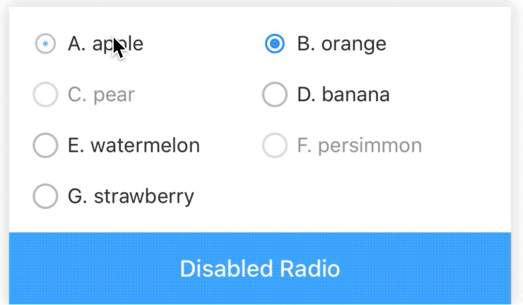
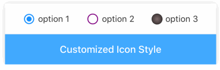
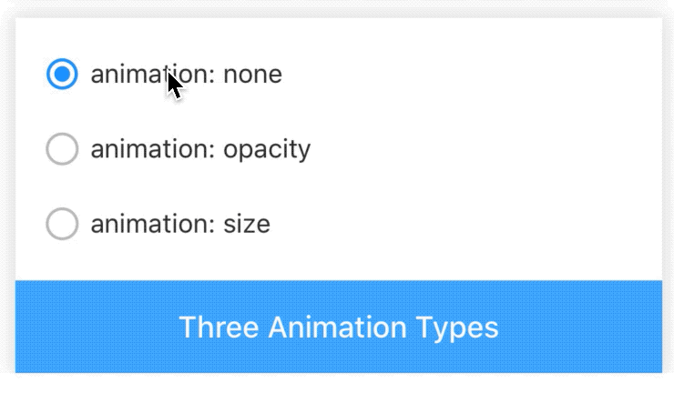

# Radio

[](https://www.npmjs.com/package/@rn-components-kit/radio)

[English](./README.md) | 中文

Radio组件让用户从一堆选项中选择一项，支持以下特性：

- 禁用点击
- 自定义选中/未选中icon或图片
- 状态切换时有过渡动画

## 使用

```bash
npm install @rn-components-kit/radio --save
```

|预览|代码|
|------------|:---------:|
||[Demo1 Code](./demos/Demo1.js)|
||[Demo2 Code](./demos/Demo2.js)|
||[Demo3 Code](./demos/Demo3.js)|
||[Demo4 Code](./demos/Demo4.js)|

## 文档

### Props for Radio.Group

- [`style`](#style)
- [`defaultValue`](#defaultValue)
- [`onValueChange`](#onValueChange)

#### `style`

自定义样式

|类型|必填|默认值|
|----|--------|-------|
|object|否|-|

#### `defaultValue`

默认值，决定当前group中哪个radio button在初始的时候被选中

|类型|必填|默认值|
|----|--------|-------|
|any|否|-|

#### `onValueChange`

```js
(value: any) => void
```

|类型|必填|默认值|
|----|--------|-------|
|function|否|() => {}|

当选中项发生变化时，会触发该回调函数

### Props for Radio.Button

- [`style`](#style)
- [`value`](#value)
- [`title`](#title)
- [`titleStyle`](#titleStyle)
- [`iconSize`](#iconSize)
- [`disabled`](#disabled)
- [`checked`](#checked)
- [`checkedIconType`](#checkedIconType)
- [`checkedIconColor`](#checkedIconColor)
- [`checkedImage`](#checkedImage)
- [`unCheckedIconType`](#unCheckedIconType)
- [`unCheckedIconColor`](#unCheckedIconColor)
- [`unCheckedImage`](#unCheckedImage)
- [`animationType`](#animationType)
- [`onPress`](#onPress)

#### `style`

自定义样式

|类型|必填|默认值|
|----|--------|-------|
|object|否|-|

#### `value`

当前选项的值，决定当前项是否会被选中

|类型|必填|默认值|
|----|--------|-------|
|any|是|-|

#### `title`

文本信息

|类型|必填|默认值|
|----|--------|-------|
|string|是|-|

#### `titleStyle`

自定义文本样式

|类型|必填|默认值|
|----|--------|-------|
|object|否|-|

#### `iconSize`

选中/未选中icon的大小（当使用checkedImage/unCheckedImage时，图片的宽高就是iconSize）

|类型|必填|默认值|
|----|--------|-------|
|number|否|20|

#### `disabled`

单选框是否可用

|类型|必填|默认值|
|----|--------|-------|
|boolean|否|false|

#### `checked`

单选框是否选中

|类型|必填|默认值|
|----|--------|-------|
|boolean|否|false|

#### `checkedIconType`

选中时展示的图标 ([Icon Preset](https://github.com/SmallStoneSK/rn-components-kit/tree/master/packages/Icon))

|类型|必填|默认值|
|----|--------|-------|
|string|否|'check-radio'|

#### `checkedIconColor`

选中图标的颜色

|类型|必填|默认值|
|----|--------|-------|
|string|否|'#1890FF'|

#### `checkedImage`

如果不满意图标集，可以指定图片代替选中时的图标

|类型|必填|默认值|
|----|--------|-------|
|string|否|-|

#### `unCheckedIconType`

未选中时展示的图标 ([Icon Preset](https://github.com/SmallStoneSK/rn-components-kit/tree/master/packages/Icon))

|类型|必填|默认值|
|----|--------|-------|
|string|否|'circle'|

#### `unCheckedIconColor`

未选中图标的颜色

|类型|必填|默认值|
|----|--------|-------|
|string|否|'#BFBFBF'|

#### `unCheckedImage`

如果不满意图标集，可以指定图片代替未选中时的图标

|类型|必填|默认值|
|----|--------|-------|
|string|否|-|

#### `animationType`

当选中状态发生变化时，指定过渡动画类型

- none: 没有动画
- opacity: 透明度发生变化，淡入/淡出
- size: 大小发生变化，放大/缩小

|类型|必填|默认值|
|----|--------|-------|
|enum(`'none'`, `'opacity'`, `'size'`)|否|'size'|

#### `onPress`

```js
() => void
```

当单选框点击时触发的回调函数

|类型|必填|默认值|
|----|--------|-------|
|function|否|() => {}|
