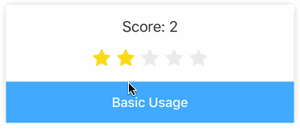
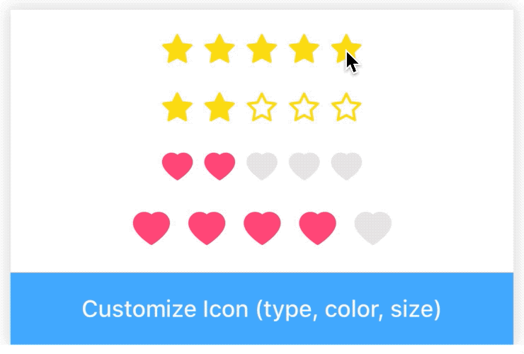
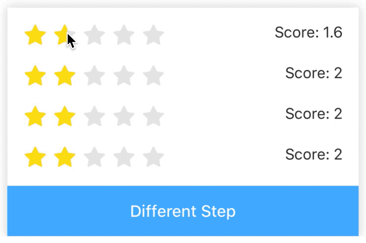

# Rating

[](https://www.npmjs.com/package/@rn-components-kit/rating)

English | [中文](./README.zh-CN.md)

Ratings are used to collect measurable feedback from users. It supports the following features:

- `touch` and `move` operation
- customized active/inactive icon (`type`, `color`, `size`)
- different step values (e.g. 0.1/0.2/0.5/1)

## How to use

```bash
npm install @rn-components-kit/rating --save
```

|Preview|Code|
|------------|:---------:|
||[Demo1 Code](./demos/Demo1.js)|
||[Demo2 Code](./demos/Demo2.js)|
||[Demo3 Code](./demos/Demo3.js)|

## Props

- [`style`](#style)
- [`step`](#step)
- [`total`](#total)
- [`value`](#value)
- [`iconGap`](#iconGap)
- [`iconSize`](#iconSize)
- [`disabled`](#disabled)
- [`activeIconType`](#activeIconType)
- [`activeIconColor`](#activeIconColor)
- [`inActiveIconType`](#inActiveIconType)
- [`inActiveIconColor`](#inActiveIconColor)
- [`onValueChange`](#onValueChange)

## Reference

### Props

#### `style`

Allows you to customize style

|Type|Required|Default|
|----|--------|-------|
|object|no|-|

#### `step`

The granularity that Rating can step through values

|Type|Required|Default|
|----|--------|-------|
|enum(`0.1`, `0.2`, `0.5`, `1`)|no|1|

#### `total`

Count of star

|Type|Required|Default|
|----|--------|-------|
|number|no|5|

#### `value`

Current count of active star

|Type|Required|Default|
|----|--------|-------|
|number|no|0|

#### `iconGap`

Space between stars

|Type|Required|Default|
|----|--------|-------|
|number|no|4|

#### `iconSize`

Size of star icon

|Type|Required|Default|
|----|--------|-------|
|number|no|20|

#### `disabled`

Determines whether value can be changed

|Type|Required|Default|
|----|--------|-------|
|boolean|no|false|

#### `activeIconType`

Icon type when it is active

|Type|Required|Default|
|----|--------|-------|
|[enum value](https://github.com/SmallStoneSK/rn-components-kit/tree/master/packages/Icon)|no|'star-fill'|

#### `activeIconColor`

Icon color when it is active

|Type|Required|Default|
|----|--------|-------|
|string|no|'#FADB14'|

#### `inActiveIconType`

Icon type when it is inactive

|Type|Required|Default|
|----|--------|-------|
|[enum value](https://github.com/SmallStoneSK/rn-components-kit/tree/master/packages/Icon)|no|'star-fill'|

#### `inActiveIconColor`

Icon color when it is inactive

|Type|Required|Default|
|----|--------|-------|
|string|no|'#E8E8E8'|

#### `onValueChange`

```js
(value: number) => void
```

A callback will be triggered when Rating's value changes

|Type|Required|Default|
|----|--------|-------|
|function|no|() => {}|
