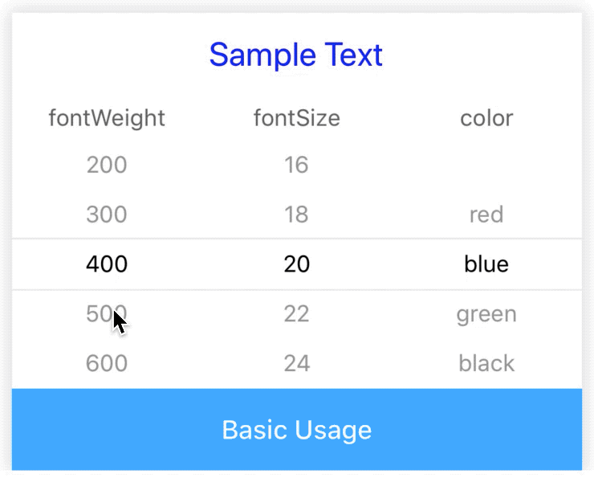
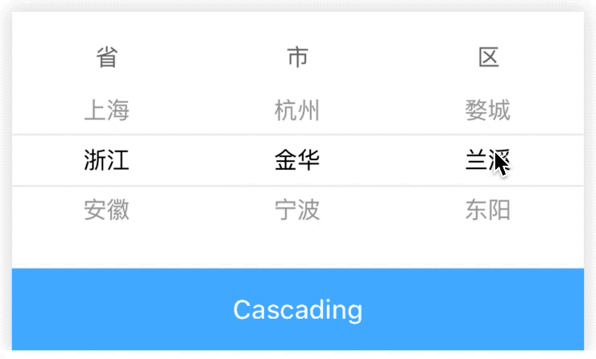
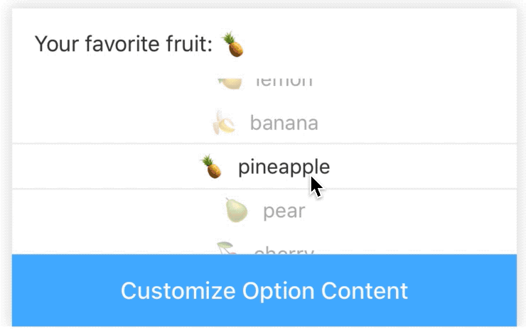

# ScrollPicker

[](https://www.npmjs.com/package/@rn-components-kit/scroll-picker)

English | [中文](./README.zh-CN.md)

Selecting option by scrolling operation. It supports following features:

- smoothing the differences between `Android` and `iOS` platforms
- multiple picker items
- cascading operation
- customized option content in `ScrollPicker.Item`

## How to use

```bash
npm install @rn-components-kit/scroll-picker --save
```

|Preview|Code|
|------------|:---------:|
||[Demo1 Code](./demos/Demo1.js)|
||[Demo2 Code](./demos/Demo2.js)|
||[Demo3 Code](./demos/Demo3.js)|

## Props

- [`style`](#style)
- [`itemHeight`](#itemHeight)
- [`onValueChange`](#onValueChange)

## Reference

### Props

#### `style`

Allow you to customize style

|Type|Required|Default|
|----|--------|-------|
|object|no|-|

#### `itemHeight`

Height of each item in `ScrollPicker.Item`

|Type|Required|Default|
|----|--------|-------|
|number|no|30|

#### `onValueChange`

```js
(value: {[key: string]: any}) => void;
```

A callback will be triggered when ScrollPicker.Item's selected value changes

|Type|Required|Default|
|----|--------|-------|
|function|no|() => {}|

### Props for ScrollPicker.Item

- [`id`](#id)
- [`flex`](#flex)
- [`data`](#data)
- [`defaultValue`](#defaultValue)
- [`renderItem`](#renderItem)

#### `id`

A unique identifier in `ScrollPicker`

|Type|Required|Default|
|----|--------|-------|
|string|yes|-|

#### `flex`

How much of the remaining space in the flex container

|Type|Required|Default|
|----|--------|-------|
|number|no|1|

#### `data`

Data source of options

|Type|Required|Default|
|----|--------|-------|
|T[]|yes|-|

#### `defaultValue`

Default value to speficy which option is selected initially (must be one of `data`)

|Type|Required|Default|
|----|--------|-------|
|T|no|data[0]|

#### `renderItem`

```js
(params: {item: T, index: number}) => React.ReactElement;
```

Allows you to customize content style

|Type|Required|Default|
|----|--------|-------|
|function|yes|-|
