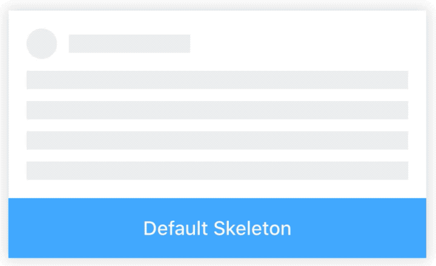

# Skeleton

[](https://www.npmjs.com/package/@rn-components-kit/skeleton)

[English](./README.md) | 中文

骨架屏，常在loading时起占位的作用，支持以下特性：

- `avatar`，`title`，`paragraph` 三部分均支持定制化
- 可以使用高阶组件`withSkeleton`完全定制化骨架屏的组成和样式

:warning: **注意**

当你使用`装饰器`的语法使用高阶组件`withSkeleton`时，确保你的项目安装了插件`@babel/plugin-proposal-decorators`.

## 使用

```bash
npm install @rn-components-kit/skeleton --save
```

|预览|代码|
|------------|:---------:|
||[Demo1 Code](./demos/Demo1.js)|
||[Demo2 Code](./demos/Demo2.js)|

## Props

- [`style`](#style)
- [`avatar`](#avatar)
- [`title`](#title)
- [`paragraph`](#paragraph)

## 文档

### Props

#### `style`

自定义样式

|类型|必填|默认值|
|----|--------|-------|
|object|否|-|

#### `avatar`

是否展示头像占位符（如果是false，该部分将不会展示）

|类型|必填|默认值|
|----|--------|-------|
|boolean \| `AvatarProps`|否|true|

**AvatarProps**

- **style** [object]: 自定义头像部分的样式
- **size** [number]: 头像的宽高。（默认 20）
- **shape** [enum(`'circle'`, `'square'`)]: 头像形状。（默认 'circle'）

#### `title`

是否展示标题占位符（如果是false，该部分将不会展示）

|类型|必填|默认值|
|----|--------|-------|
|boolean \| `TitleProps`|否|true|

**TitleProps**

- **style** [object]: 自定义标题部分的样式
- **width** [number | string]: 标题部分的宽度
- **height** [number]: 标题部分的高度（默认 15）

#### `paragraph`

是否展示段落占位符（如果是flase，该部分将不展示）

|类型|必填|默认值|
|----|--------|-------|
|boolean \| `ParagraphProps`|否|true|

**ParagraphProps**

- **style** [object]: 自定义段落部分的样式
- **rows** [number]: 段落部分的行数。（默认 3）
- **widths** [Array<number | string>]: 每个色块的宽度（如果是undefined或null，默认100%）
- **heights** [Array<number>]: 每个色块的高度（如果是undefined或null，默认15）

## Props for withSkeleton

- [`options`](#options)

## Reference for withSkeleton

#### `options`

骨架屏配置

|类型|必填|默认值|
|----|--------|-------|
|`withSkeletonOptions`|否|{duraion: 1000, minOpacity: 0.2, maxOpacity: 1}|

**withSkeletonOptions**

- **duraion** [number]: 动画循环一次的时间 (默认: 1000)
- **minOpacity** [number]: 动画过程中，最小透明度 (默认: 0.2)
- **maxOpacity** [number]: 动画过程中，最大透明度 (默认: 1)
