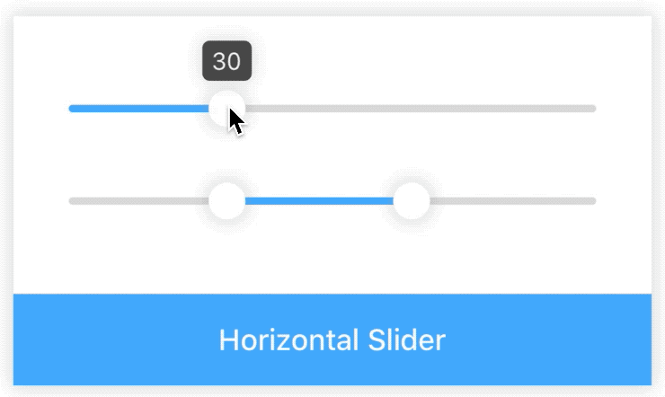
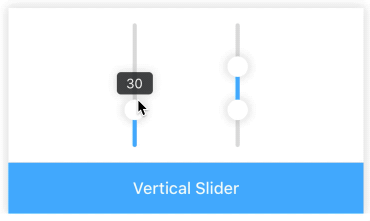
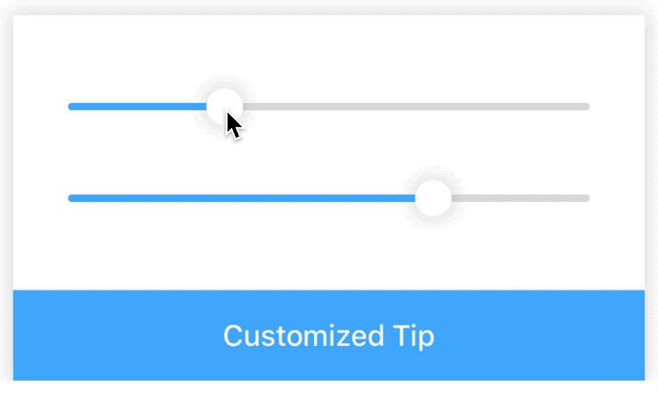
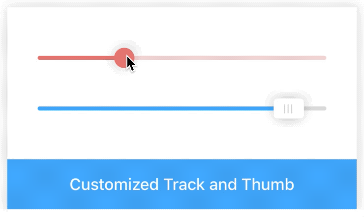

# Slider

[](https://www.npmjs.com/package/@rn-components-kit/slider)

[English](./README.md) | 中文

以滑动的交互形式，从指定范围内选择值。支持以下特性：

- `水平`或`垂直`两种方向
- `1`或`2`个滑块
- 滑块和轨道样式高度可定制化
- tip文案可定制化

## How to use

```bash
npm install @rn-components-kit/slider --save
```

|预览|代码|
|------------|:---------:|
||[Demo1 Code](./demos/Demo1.js)|
||[Demo2 Code](./demos/Demo2.js)|
||[Demo3 Code](./demos/Demo3.js)|
||[Demo4 Code](./demos/Demo4.js)|

## Props

- [`style`](#style)
- [`min`](#min)
- [`max`](#max)
- [`step`](#step)
- [`multi`](#multi)
- [`vertical`](#vertical)
- [`showTip`](#showTip)
- [`tipContainerStyle`](#tipContainerStyle)
- [`tipTextStyle`](#tipTextStyle)
- [`trackColor`](#trackColor)
- [`selectedTrackColor`](#selectedTrackColor)
- [`thumbStyle`](#thumbStyle)
- [`renderThumb`](#renderThumb)
- [`tipFormatter`](#tipFormatter)
- [`onValueChange`](#onValueChange)
- [`onBeginSliding`](#onBeginSliding)
- [`onEndSliding`](#onEndSliding)

## 文档

### Props

#### `style`

自定义样式

|类型|必填|默认值|
|----|--------|-------|
|object|否|-|

#### `min`

滑块最小能滑到的值

|类型|必填|默认值|
|----|--------|-------|
|numer|否|0|

#### `max`

滑块最大能滑到的值

|类型|必填|默认值|
|----|--------|-------|
|number|否|100|

#### `step`

滑块每滑动一格的步长。（必须大于0，且能被`(max- min)`整除)

|类型|必填|默认值|
|----|--------|-------|
|number|否|1|

#### `multi`

false时，只有一个滑块；true时，有两个滑块

|类型|必填|默认值|
|----|--------|-------|
|boolean|否|false|

#### `vertical`

垂直模式

|类型|必填|默认值|
|----|--------|-------|
|boolean|否|false|

#### `showTip`

当拖拽滑块时，是否显示Tooltip

|类型|必填|默认值|
|----|--------|-------|
|boolean|否|false|

#### `tipContainerStyle`

自定义Tooltip容器的样式（例如：size, backgroundColor）

|类型|必填|默认值|
|----|--------|-------|
|object|否|-|

#### `tipTextStyle`

自定义Tooltip内文字的样式（例如：fontSize, color）

|类型|必填|默认值|
|----|--------|-------|
|object|否|-|

#### `trackColor`

轨道颜色

|类型|必填|默认值|
|----|--------|-------|
|string|否|'#DDD'|

#### `selectedTrackColor`

轨道被选中部分的颜色

|类型|必填|默认值|
|----|--------|-------|
|string|否|'#40A9FF'|

#### `thumbStyle`

自定义滑块样式（例如：color, size, shadow）

|类型|必填|默认值|
|----|--------|-------|
|object|否|-|

#### `renderThumb`

```js
() => void
```

完全自定义滑块部分

|类型|必填|默认值|
|----|--------|-------|
|function|否|() => {}|

#### `tipFormatter`

```js
(value: number) => string
```

Slider组件将会把当前值传给tipFormatter，然后将其返回值显示在Tooltip中

|类型|必填|默认值|
|----|--------|-------|
|function|否|value => value.toString()|

#### `onValueChange`

```js
(value: number) => void
```

当Slider组件中的value值发生变化时，会触发该回调函数

|类型|必填|默认值|
|----|--------|-------|
|function|否|() => {}|

#### `onBeginSliding`

```js
() => void
```

当Slider组件开始滑动时，会触发该回调函数

|类型|必填|默认值|
|----|--------|-------|
|function|否|() => {}|

#### `onEndSliding`

```js
() => void
```

当Slider组件结束滑动时，会触发该回调函数

|类型|必填|默认值|
|----|--------|-------|
|function|否|() => {}|
