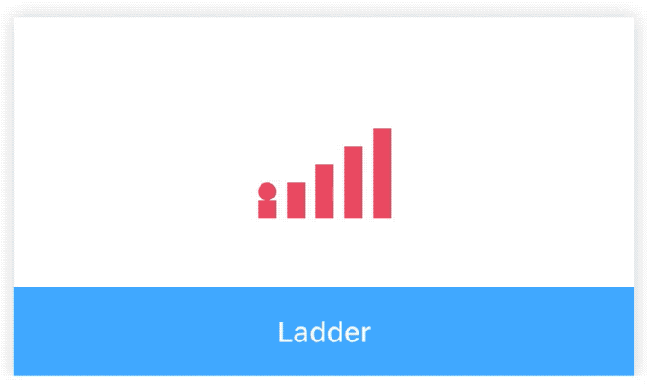
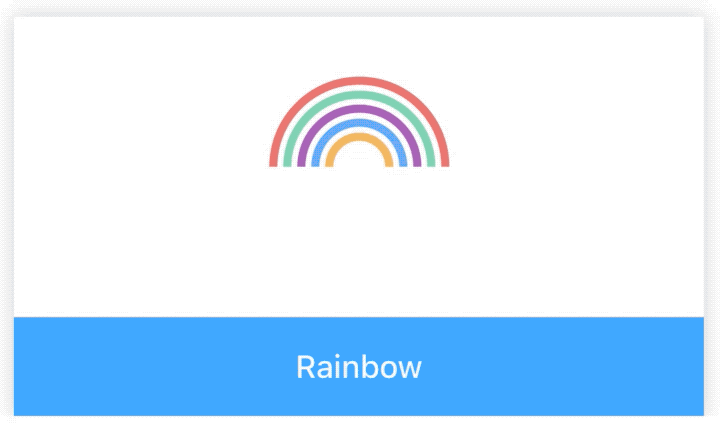
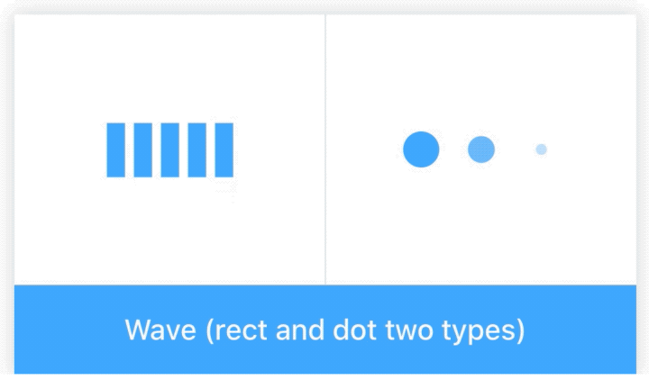
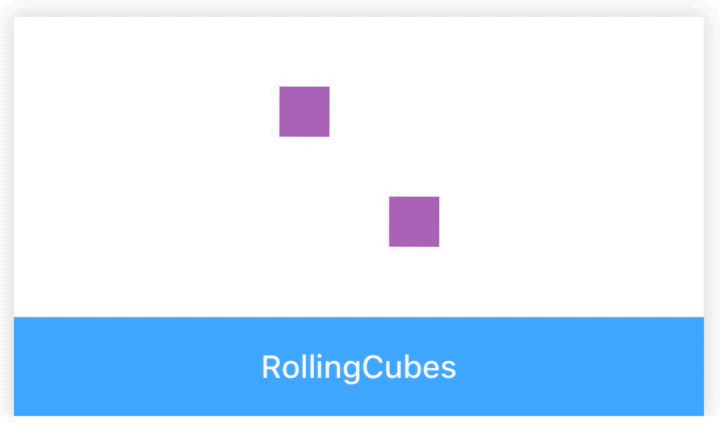
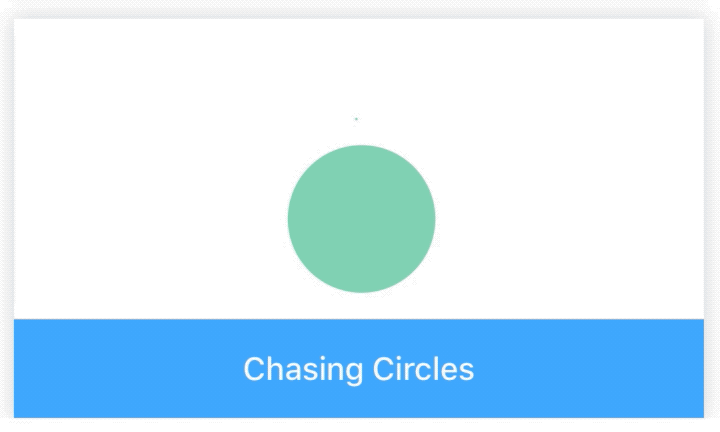
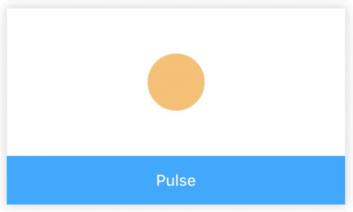
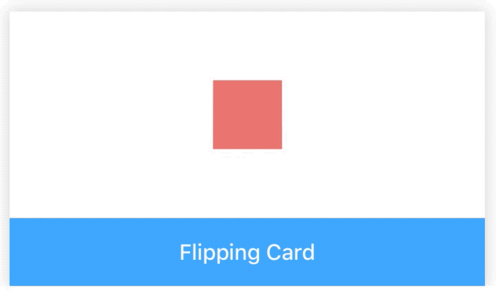

# Spin

[](https://www.npmjs.com/package/@rn-components-kit/spin)

English | [中文](./README.zh-CN.md)

For displaying loading state of a page or a section. It supports 7 categories of spinner:

- [`Ladder`](#props-for-ladder)
- [`Rainbow`](#props-for-rainbow)
- [`Wave`](#props-for-wave)
- [`RollingCubes`](#props-for-rollingcubes)
- [`ChasingCircles`](#props-for-chasingcircles)
- [`Pulse`](#props-for-pulse)
- [`FlippingCard`](#props-for-flippingcard)

## How to use

```bash
npm install @rn-components-kit/spin --save
```

|Preview|Code|
|------------|:---------:|
||[Demo1 Code](./demos/Demo1.js)|
||[Demo2 Code](./demos/Demo2.js)|
||[Demo3 Code](./demos/Demo3.js)|
||[Demo4 Code](./demos/Demo4.js)|
||[Demo5 Code](./demos/Demo5.js)|
||[Demo6 Code](./demos/Demo6.js)|
||[Demo7 Code](./demos/Demo7.js)|

## Reference

## Props for Ladder

#### `style`

Allows you to customize style

|Type|Required|Default|
|----|--------|-------|
|object|no|-|

#### `scale`

Zooming in/out scale of component

|Type|Required|Default|
|----|--------|-------|
|number|no|1|

#### `duration`

Duration of a looped animation

|Type|Required|Default|
|----|--------|-------|
|number|no|5000|

#### `color`

Color of elements inside component

|Type|Required|Default|
|----|--------|-------|
|string|no|'#40A9FF'|

## Props for Rainbow

#### `style`

Allows you to customize style

|Type|Required|Default|
|----|--------|-------|
|object|no|-|

#### `scale`

Zooming in/out scale of component

|Type|Required|Default|
|----|--------|-------|
|number|no|1|

#### `duration`

Duration of a looped animation

|Type|Required|Default|
|----|--------|-------|
|number|no|5000|

#### `colors`

**Five** colors passed to rainbow

|Type|Required|Default|
|----|--------|-------|
|string[]|no|['#EA7671', '#81D2B4', '#A963B8', '#70ACF6', '#F4B860']|

## Props for Wave

#### `style`

Allows you to customize style

|Type|Required|Default|
|----|--------|-------|
|object|no|-|

#### `type`

Type of wave

|Type|Required|Default|
|----|--------|-------|
|enum(`'rect'`, `'dot'`)|no|'rect'|

#### `scale`

Zooming in/out scale of component

|Type|Required|Default|
|----|--------|-------|
|number|no|1|

#### `duration`

Duration of a looped animation

|Type|Required|Default|
|----|--------|-------|
|number|no|5000|

#### `color`

Color of elements inside component

|Type|Required|Default|
|----|--------|-------|
|string|no|'#40A9FF'|


## Props for RollingCubes

#### `style`

Allows you to customize style

|Type|Required|Default|
|----|--------|-------|
|object|no|-|

#### `scale`

Zooming in/out scale of component

|Type|Required|Default|
|----|--------|-------|
|number|no|1|

#### `duration`

Duration of a looped animation

|Type|Required|Default|
|----|--------|-------|
|number|no|2200|

#### `color`

Color of elements inside component

|Type|Required|Default|
|----|--------|-------|
|string|no|'#40A9FF'|

## Props for ChasingCircles

#### `style`

Allows you to customize style

|Type|Required|Default|
|----|--------|-------|
|object|no|-|

#### `scale`

Zooming in/out scale of component

|Type|Required|Default|
|----|--------|-------|
|number|no|1|

#### `duration`

Duration of a looped animation

|Type|Required|Default|
|----|--------|-------|
|number|no|1800|

#### `color`

Color of elements inside component

|Type|Required|Default|
|----|--------|-------|
|string|no|'#40A9FF'|

## Props for Pulse

#### `style`

Allows you to customize style

|Type|Required|Default|
|----|--------|-------|
|object|no|-|

#### `scale`

Zooming in/out scale of component

|Type|Required|Default|
|----|--------|-------|
|number|no|1|

#### `duration`

Duration of a looped animation

|Type|Required|Default|
|----|--------|-------|
|number|no|2000|

#### `color`

Color of elements inside component

|Type|Required|Default|
|----|--------|-------|
|string|no|'#40A9FF'|

## Props for FlippingCard

#### `style`

Allows you to customize style

|Type|Required|Default|
|----|--------|-------|
|object|no|-|

#### `scale`

Zooming in/out scale of component

|Type|Required|Default|
|----|--------|-------|
|number|no|1|

#### `duration`

Duration of a looped animation

|Type|Required|Default|
|----|--------|-------|
|number|no|1200|

#### `color`

Color of elements inside component

|Type|Required|Default|
|----|--------|-------|
|string|no|'#40A9FF'|
