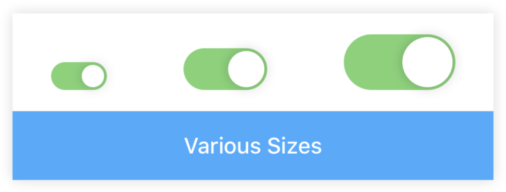
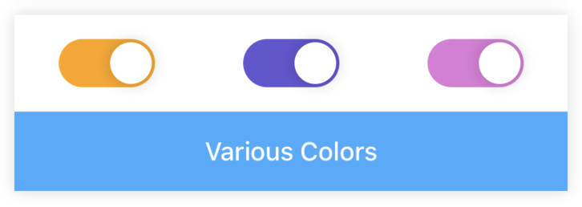
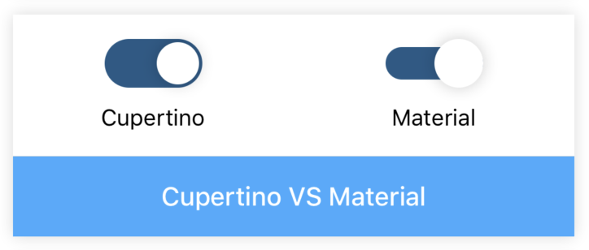
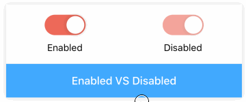
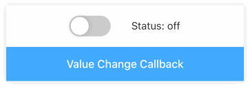

# Switch

[](https://www.npmjs.com/package/@rn-components-kit/switch)

English | [中文](./README.zh-CN.md)

Switching selector. It supports the following features:

- customize color
- customize size
- two types: `cupertino` and `material`

## How to use

```bash
npm install @rn-components-kit/switch --save
```

|Preview|Code|
|------------|:---------:|
||[Demo1 Code](./demos/Demo1.js)|
||[Demo2 Code](./demos/Demo2.js)|
||[Demo3 Code](./demos/Demo3.js)|
||[Demo4 Code](./demos/Demo4.js)|
||[Demo5 Code](./demos/Demo5.js)|

## Props

- [`style`](#style)
- [`type`](#type)
- [`value`](#value)
- [`disabled`](#disabled)
- [`width`](#width)
- [`height`](#height)
- [`thumbRadius`](#thumbRadius)
- [`thumbColor`](#thumbColor)
- [`trackOnColor`](#trackOnColor)
- [`trackOffColor`](#trackOffColor)
- [`onValueChange`](#onValueChange)

## Reference

### Props

#### `style`

Allows you to customize style

|Type|Required|Default|
|----|--------|-------|
|object|no|-|

#### `type`

Two types (`cupertino` for IOS and `material` for Android)

|Type|Required|Default|
|----|--------|-------|
|enum(`'cupertino'`, `'material'`)|no|'cupertino'|

#### `value`

Determines whether switch is on when initial rendering

|Type|Required|Default|
|----|--------|-------|
|boolean|no|false|

#### `disabled`

Determines whether switch is touchabled

|Type|Required|Default|
|----|--------|-------|
|boolean|no|false|

#### `width`

Width of switch

|Type|Required|Default|
|----|--------|-------|
|number|no|40|

#### `height`

Height of switch's track

|Type|Required|Default|
|----|--------|-------|
|number|no|20|

#### `thumbRadius`

Radius of thumb

|Type|Required|Default|
|----|--------|-------|
|number|no|8|

#### `thumbColor`

Color of thumb

|Type|Required|Default|
|----|--------|-------|
|string|no|'#FFF'|

#### `trackOnColor`

Color of track when switch is "on" status

|Type|Required|Default|
|----|--------|-------|
|string|no|'#79D472'|

#### `trackOffColor`

Color of track when switch is "off" status

|Type|Required|Default|
|----|--------|-------|
|string|no|'#CCC'|

#### `onValueChange`

```js
(value: boolean) => void
```

A callback will be triggered when switch's status changes

|Type|Required|Default|
|----|--------|-------|
|function|no|() => {}|