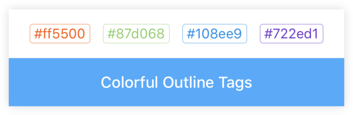
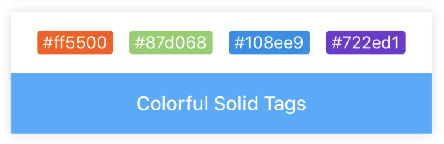
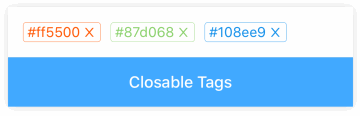

# Tag

[](https://www.npmjs.com/package/@rn-components-kit/tag)

English | [中文](./README.zh-CN.md)

Tag for categorizing or markup. It supports the following features:

- custom color
- two types: `outline` and `solid`
- closable and its callback

## How to use

```bash
npm install @rn-components-kit/tag --save
```

|Preview|Code|
|------------|:---------:|
||[Demo1 Code](./demos/Demo1.js)|
||[Demo2 Code](./demos/Demo2.js)|
||[Demo3 Code](./demos/Demo3.js)|

## Props

- [`style`](#style)
- [`text`](#text)
- [`type`](#type)
- [`color`](#color)
- [`fontSize`](#fontSize)
- [`paddingHorizontal`](#paddingHorizontal)
- [`paddingVertical`](#paddingVertical)
- [`borderRadius`](#borderRadius)
- [`animatedWhenDisappear`](#animatedWhenDisappear)
- [`animationDuration`](#animationDuration)
- [`closable`](#closable)
- [`onClose`](#onClose)

## Reference

### Props

#### `style`

Allow you to custom style

|Type|Required|Default|
|----|--------|-------|
|object|no|-|

#### `text`

Text inside tag to display

|Type|Required|Default|
|----|--------|-------|
|string|yes|''|

#### `type`

Determines the tag's type (outline or solid)

|Type|Required|Default|
|----|--------|-------|
|enum(`'outline'`, `'solid'`)|no|'outline'|

#### `color`

Determines the tag's color

|Type|Required|Default|
|----|--------|-------|
|string|no|'#333'|

#### `fontSize`

Determines the fontSize of tag's text

|Type|Required|Default|
|----|--------|-------|
|number|no|14|

#### `paddingHorizontal`

Padding value in the horizontal orientation

|Type|Required|Default|
|----|--------|-------|
|number|no|4|

#### `paddingVertical`

Padding value in the vertical orientation

|Type|Required|Default|
|----|--------|-------|
|number|no|1|

#### `borderRadius`

Determines the border radius value of tag

|Type|Required|Default|
|----|--------|-------|
|number|no|3|

#### `animatedWhenDisappear`

Determines whether an animation enabled when the tag is closed

|Type|Required|Default|
|----|--------|-------|
|boolean|no|false|

#### `animationDuration`

Determines how long the disappearing animation will take when tag is closed. (ms)

|Type|Required|Default|
|----|--------|-------|
|number|no|300|

#### `closable`

Determines whether a tag can be closed

|Type|Required|Default|
|----|--------|-------|
|boolean|no|false|

#### `onClose`

```js
(text: string) => void
```

A callback will be triggered when the tag is closed

|Type|Required|Default|
|----|--------|-------|
|function|no|() => {}|
