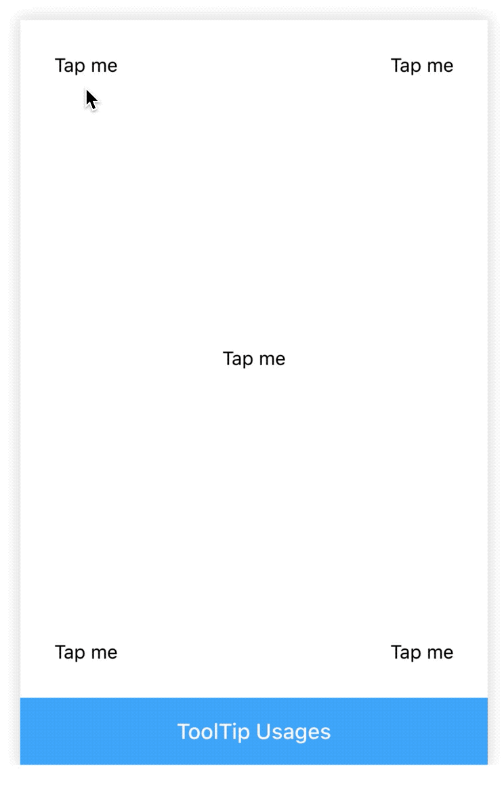

# Tooltip

[](https://www.npmjs.com/package/@rn-components-kit/tooltip)

English | [中文](./README.zh-CN.md)

Tooltips display infomation when users tap on an element. It supports the following features:

- `top` and `bottom` two directions to place tooltip content
- fully customized toopltip content

## How to use

```bash
npm install @rn-components-kit/tooltip --save
```

|Preview|Code|
|------------|:---------:|
||[Demo1 Code](./demos/Demo1.js)|

## Props

- [`style`](#style)
- [`popup`](#popup)
- [`popupContainerStyle`](#popupContainerStyle)
- [`popupTextStyle`](#popupTextStyle)
- [`showCaret`](#showCaret)
- [`backgroundColor`](#backgroundColor)
- [`overlayColor`](#overlayColor)
- [`placement`](#placement)
- [`onOpen`](#onOpen)
- [`onClose`](#onClose)

## Methods

- [`open`](#open)
- [`close`](#close)

## Reference

### Props

#### `style`

Allows you to customize style

|Type|Required|Default|
|----|--------|-------|
|object|no|-|

#### `popup`

Content to show when tooltip pressed. If it is a string, it will be wrapped within Text component. You can also pass a customized ReactElement

|Type|Required|Default|
|----|--------|-------|
|string \| ReactElement|yes|-|

#### `popupContainerStyle`

Customized style for popup content's container

|Type|Required|Default|
|----|--------|-------|
|object|no|-|

#### `popupTextStyle`

Customized style for popup text (works only when popup is a string)

|Type|Required|Default|
|----|--------|-------|
|object|no|-|

#### `showCaret`

Determines whether to show display pointer

|Type|Required|Default|
|----|--------|-------|
|boolean|no|true|

#### `backgroundColor`

Background color of tooptip (also for caret if showCaret is true)

|Type|Required|Default|
|----|--------|-------|
|string|no|'rgba(0,0,0,.8)'|

#### `overlayColor`

Background color of overlay (you can use rgba to control the opacity)

|Type|Required|Default|
|----|--------|-------|
|string|no|'rgba(0,0,0,.1)'|

#### `placement`

Controls where to show tooltip

|Type|Required|Default|
|----|--------|-------|
|enum(`'top'`, `'bottom'`)|no|'bottom'|

#### `onOpen`

```js
() => void
```

A callback will be triggered when tooltip opens

|Type|Required|Default|
|----|--------|-------|
|function|no|() => {}|

#### `onClose`

```js
() => void
```

A callback will be triggered when tooltip closes

|Type|Required|Default|
|----|--------|-------|
|function|no|() => {}|

### Methods

#### `open`

```js
open()
```

Normally, Tooltip component has taken over the work of opening/closing. But in some cases, you can also use this function to open tooltip

#### `close`

```js
close()
```

Normally, Tooltip component has taken over the work of opening/closing. But in some cases, you can also use this function to close tooltip
